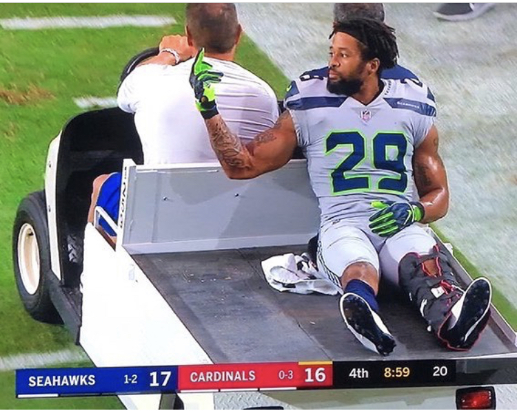

# LGED 21-22 Week-12 Recap: Playoff Spots Still Up For Grabs

### Whaddup

We are back with 2 more weeks left in the LGED 2021 regular season. For most of the league, playoff hopes still remain. 

As a reminder, outside of the top slot in the division, it goes by overall record regardless of position. Here is information on how the tie breakers work for [playoff seeding](https://support.espn.com/hc/en-us/articles/360036952471-Playoff-Seeding-How-Regular-Season-Standings-Tiebreakers-Work)

Good luck fellow degenerates.

Now onto the writeup.

 
 

| W  | | L   |   |
| ------------------------ |:-------------:| --------------------|:----------:|
|     **Yoon Pooned**      |**81.0**     | Kingdom DooDoo|   72.7  |

The streak stays alive. My team eeks out the win against Miles’ Kingdom DooDoo. My team has now put together back to back sub 90 point performances. This week, my team’s worst output of the season. Lamar Jackson threw 4 interceptions on his way to his own worst fantasy performance with 9.4 points. Jackson is now 2nd in the NFL with 12 interceptions just 1 behind Ryan Tannehill. Nick Chubb also couldn’t get much going in the same game and rushed for his season low 16 yards. It wasn’t all bad. Cordarrelle Patterson returned from injury and put up 135 yards from scrimmage and rushed for 2 touchdowns. Yoon Pooned’s star Cooper Kupp returned from bye with 7 catches for 96 yards. Patriots D/ST added in their own 12 points thanks to some classic Bill Belicheck defense. The rest of the players on my team combined for just 13.1 points (4 players). The streak continues but at what cost?? Over half of Miles’ team played on Thanksgiving. Josh Allen was the big point getter for Kingdom DooDoo this week with 26.7 points thanks to 4 touchdown passes. D’Andre Swift got hurt on turkey day, but Miles didn’t fret all too much as he had Swift’s running back mate Jamaal Williams. Unfortunately, the two combined for only 13.2 points. Cole Beasley wasn’t the recipient for any of Allen’s touchdown passes but still managed 46 yards on a perfect 5/5 in receptions. Darren Waller must have been only thinking turkey as he puts up his worst fantasy game of the season with 4.3 points. This loss may have knocked Miles’ out of the playoff hunt. He’ll need to win out for even a chance to make it into the LGED postseason. Kingdom DooDoo has sorely missed its king.

 
 

| W  | | L   |   |
| ------------------------ |:-------------:| --------------------|:----------:|
|     **Leonard’s Bakery**      |**96.12**     | Carroll’s A Coward|   93.92  |

Leonard’s Bakery was open and cookin. Danny gets the close win over Kyle thanks to head baker Leonard Fournette. Fournette turned on the burners and went for 131 yards from scrimmage with 3 rushing touchdowns and 1 receiving touchdown for 40.6 points. Who knew in the Buccaneers vs Colts matchup that the lead fantasy RB wouldn’t be Jonathan Taylor. Javonte Williams joined in on the touchdown action with 1 of his own on top of 111 yards from scrimmage. Justin Jefferson only caught 4 of 9 of his targets but still managed 83 yards scoring 11.26 fantasy points. Outside of those 3, the rest of Danny’s squad only put up 25.66 points (6 players). QB Jalen Hurts’ first game under 10 points. He also threw 3 interceptions. All of Hurts’ fantasy points came from 77 rushing yards. Both of Danny’s Saints RBs were out. Kyle’s team, despite the loss, all chipped in. Only 3 players didn’t score above 10 points. With Patrick Mahomes on bye, Kyle turned to Tyrod Taylor who did a sufficient job as a streamed QB with 15.32 points. Kyle’s team was missing a single touchdown that would have won him this week’s matchup. Outside of Taylor’s passing touchdowns, not a single one of Kyle’s starting lineup found the endzone. Davante Adams, DJ Moore and Rob Gronkowski all had 100+ receiving yards. James Robinson had a good game as well but did fumble the ball which subtracted 2 crucial points. What must have been frustrating are the 2 players on Kyle’s bench that could have been subbed in at the FLEX slot for the win. It always seems like Myles Gaskin comes through when Kyle benches him. Gaskin had 18.2 points thanks to 2 touchdowns (go dawgs). Kyle sits at 6 - 6 with 3 other teams and will need to do well the last 2 games of the regular fantasy season to clinch a playoff spot.

 
 

| W  | | L   |   |
| ------------------------ |:-------------:| --------------------|:----------:|
|     **OJ is my GM**      |**110.82**     | EBDB BnB|   98.44  |

I love it. Anil and OJ just out here to ruin streaks and playoff hopes. This week, it’s the former. Anil hands Andrew just his third loss this season and first since week 3. An 8 game winning streak snapped. Anil and OJ have now put together back to back 110+ point weeks. A lot of the success has come from the LA Chargers offense. Austin Ekeler caught 6 passes again this week for 68 yards and a reception touchdown. Keenan Allen continues to be the steadiest player in PPR fantasy. Allen has only scored 2 touchdowns all season. He has only dipped below 10 points twice. Currently, Allen is averaging 7 catches a game and is on a 5 game streak of 10+ targets. Brandon Aiyuk has been living up to his pre-draft hype the last few weeks. Aiyuk had 91 receiving yards on 3 catches. Antonio Gibson was the big cherry on top on Monday night as he ran all over the Seahawks for a season high 111 rushing yards. Gibson also added 35 receiving yards on 7 catches. Can’t wait to see what’s in store next week as Anil and OJ go up against Poop AUTO who's vying for a playoff spot as well. For Andrew and EBDB BnB, somewhat of a down week. Surprisingly, Andrew scored much less one week during his win streak and managed a win (week 10: 75.7 points). The star of EBDB BnB, Jonathan Taylor, had a mediocre game for his standards. Taylor still found the endzone and rushed for 83 yards. Jaylen Waddle has been streaky this season but through 12 weeks sits at WR14. Waddle recorded himself a season high in yardage with 137 yards and caught 9 of 10 of his targets and a touchdown. Tee Higgins followed suit with his best performance of the season with 114 yards and a touchdown. Outside of those three, not much to praise. Justin Tucker did his normal thing and put up 13 points. DK Metcalf had a season low with just 1 catch for 13 yards. The last three weeks Metcalf has averaged just 3.7 points. Tom Brady might be hibernating a bit as he seems to have hit a lull himself the last three weeks. Brady has thrown just 1 less interception than touchdown passes. Andrew probably isn’t worried too much as he looks on to the playoffs.

 
 

| W  | | L   |   |
| ------------------------ |:-------------:| --------------------|:----------:|
|     **Poop AUTO**      |**107.28**     | I need Moore points|   70.72  |

A good win for Kai to help lock in a playoff spot. For Junghwan, a tough loss. There is a slim chance he could make the playoffs now. He’ll need a few teams ahead of him to lose. For Kai though, a wonky week but it got the job done. Joe Mixon has been tearing it up the last 6 weeks. Only once has Mixon dropped below 23 points in that span. This week, Mixon had a season high in rush yards and scored 2 rushing touchdowns which all lead to his best fantasy performance of the season, 30.3 points. AJ Dillon was a good pick up in early November. Kai picked up Dillon right before Aaron Jones went down with an injury. Dillon has been solid so far as him and the Packers continue to roll. Matthew Stafford finally seemed to get out of his slump and threw for more touchdowns than interceptions. Kai’s receivers, Mike Evans and Marquise Brown both had down weeks. A top heavy performance but enough to snag the win. Kai now sits at 7 - 5 right above the rest of the folks sniffing the playoffs at 6 - 6. Mannnn Junghwan’s team just can’t find a rhythm. For a little bit, it seemed like his team was carrying the load until Saquon Barkley returned. When Barkely did, the rest of the team just stopped producing. In the last 4 weeks, Junghwan’s team scored over 100 points just once. The rest of the weeks? All in the 70s, all losses. Kyle Pitts hasn’t been producing that well despite a decent amount of targets sent his way. Pitts is averaging 6 targets in the last 5 weeks with a fantasy point average of 5.2. Najee Harris has been solid this season. This week however, his worst performance of the season with just 5.2 fantasy points. Terry McLaurin might be as streaky as they come. He has weeks with under 10 point performances, but explodes for 20+ every now and then. Brandin Cooks has exceeded my expectations, but doesn’t have big games. Cooks’ best fantasy performance this season was in week 2 with 18.3 points. Junghwan did get some production at the QB slot this week though! Derek Carr ended his 5 week under 20 fantasy points streak with 22.02. Mathematically, Junghwan is still in it if he wins out and scores big. Next week, Yoon Pooned.

 
 

| W  | | L   |   |
| ------------------------ |:-------------:| --------------------|:----------:|
|     **DK’s Left Calf**      |**124.88**     | Smokin’ Herbs 🚬|   91.02  |

Big win for Zach’s team to remain in the playoff hunt. Matt on the other hand drops to 6 - 6 and sits in one of 2 hot seats for the playoffs. For Zach’s team, the Seahawks vibes were okay. Russell Wilson had, sadly, his best game after returning from injury scoring more points than his previous two outings combined. Tyler Lockett was just 4 yards shy of another 100 yard game. Deebo Samuel continues his impressive season. Samuel has two weeks in a row with more rushing yards than receiving yards. He has scored the same number of rushing touchdowns as receiving touchdowns with 5 each. Curious to see if other WRs are used this way in the future. Samuel appears to be banged up and hopefully isn’t out too long. Dolphins D/ST continues their great play. Since week 9, they have only allowed over 10 points just once. In that same time, they have recorded 16 sacks, 7 interceptions and scored 2 touchdowns. Ezekiel Elliot had the same number of carries (9) and receptions (6) for two weeks straight. Darrell Henderson Jr. found the endzone again after a 2 week dry spell. Hope for Zach’s team remains, next week is a big matchup against a rolling Leonard’s Bakery. A mediocre week for Matt’s squad. Most of Matt’s starting lineup put up decent numbers but no one put up 20+ points. Josh Jacobs did have his best fantasy performance of the season behind a season high in carries with 22. Diontae Johnson tried to do the most with his whopping 14 targets hauling in 9 of them for 95 yards. Ja’Marr Chase cooled off a bit this week with his worst performance with just 5.4 fantasy points. Chase was only targeted 3 times but did catch all three of those targets. George Kittle had a similar week with his own worst fantasy performance with just 1 catch for 13 yards. Unfortunately, Dalvin Cook went down with a dislocated shoulder and is set to miss at least the next 2 games. Those will be 2 crucial games as Matt hopes to lock up a playoff spot. Matt’s next to matchups are against 2 below .500 teams. If he can lock in a playoff spot and Cook returns, Matt could find himself in good shape for a deep playoff run.

 
 

| W  | | L   |   |
| ------------------------ |:-------------:| --------------------|:----------:|
|     **Fudge Packers**      |**152.88**     | Im just … Tired|   64.5  |

Once again this season, the highest scoring team versus the lowest scoring team. Connor absolutely crushes and now sits at 6 - 6 (a record we all saw coming). Eugene at this point is hibernating until next season. More on both their performances right below.

 
 

## Highest Scoring Team
**Fudge Packers - Connor**\
**152.88 Points**\
**Best Player: Aaron Rodgers QB - 26.28 Points**\
A true team effort\
Your team had 4 players score at least 20 points\
Only 2 players didn’t score over 10 points, without them your team still would have been highest scoring with 140.38\
All your TE and WR on your team scored a touchdown\
Elijah Mitchell had 168 yards from scrimmage and a touchdown\
Adam Thielen had 62 receiving yards and 2 touchdowns\
Your kicker alone scored 20 points and he even missed a 50+ yard field goal\
Duel TE lineup looks nice on you and the Fudge Packers\
Too bad we all know you’ll end up 7 - 7\
Keep the record ALIVE

## Lowest Scoring Team
**Im just … Tired - Eugene**\
**64.5 Points**\
**Best Player: Dak Prescott QB - 25.3 Points**\
Man this is your third time in the roast\
Only 1 player on your team actually won their week 12 matchup, Ravens D/ST\
3 of your players didn’t even play\
Your team didn’t even have the capability to start a full roster for week 12\
You have the LGED’s permission to sleep until next season\
Just like your sleepy effort in starting a lineup, here’s my tired roast\
However, your team reminds us that having a top 2 pick in the draft is more of a curse than a blessing\
So for that, we thank you.

#### Good luck in week 13 you fucking degenerates

[HOME](../index.md)

[Week 9](./2021_week9_writeup.md)

[Week 13](./2021_week13_writeup.md)

