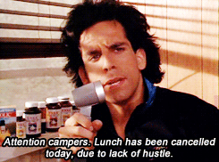

# LGED 21-22 Week-6 Recap: Bye Weeks Begin, A Winless Team Remains

### Whaddup

Bye weeks are here. That’s it. I’m sure all you GM’s are aware.

One winless team remains while an undefeated team records its first loss. A new team now sits at the top of the league (spoilers: it's my team, let’s go Yoon Pooned). 

Enough about my team the league.

Onto the matchups:

 
 

| W  | | L   |   |
| ------------------------ |:-------------:| --------------------|:----------:|
|     **Golladay Inn Express**      |**99.2**     | Carroll’s A Coward |   96.18   |

Down goes Kyle. Danny serves up Kyle’s first loss this season, snapping a 5 game winning streak. Danny’s team gets the win after back to back losses to get his fourth W of the season. Of course, I’m gonna start with Jalen Hurts. Hurts continues to dazzle and continues his streak of 20+ points. Hurts now has a 2 game streak with 2 rushing touchdowns. Leonard Fournette has increased in fantasy football points for the last 3 weeks. This week, Fournette put up his highest point total so far thanks to 127 yards from scrimmage and 2 rushing TDs (27.8 points). Justin Jefferson lost a fumble for the first time in his career to bring his score down lower than Odell Beckham Jr. Them LSU boys have to stick together. It wasn’t a big week from the Golladay Inn Express, but it was enough to take down the team with the best record in the league. I like to think it was Pete Carroll and the hawks that put the Steelers D/ST down enough points on Sunday Night Football to seal Kyle’s fate. Maybe someway, somehow, Kyle’s team triggered something in Coach Carroll to make sure Kyle wasn’t going to win. Or it was the fact that only 1 skill player on Kyle’s team scored a touchdown, James Robinson. Robinson 20+ fantasy point streak comes to an end with 17.6. Everyone else also cooled down. Almost half of Kyle’s team did worse than last week. A good sign was Patrick Mahomes. Mahomes continues to be the highest scoring player in fantasy this year. Mahomes is still throwing interceptions but is finding success. Kareem Hunt did go down with a calf injury and was placed on IR. Kyle’s lowest scoring week so far, hopefully just a lull.

 
 

| W  | | L   |   |
| ------------------------ |:-------------:| --------------------|:----------:|
|     **Fudge Packers**      |**133.7**     | Im just … Tired |   100.9   |

Connor and the Fudge Packers keep Eugene’s team tired with a win this week. The Fudge Packers are also this week’s highest scoring team. Connor’s 6 weeks so far:

|Week| Result|
|:------:|:--------:|
|1| L|
|2|W|
|3|L|
|4|W|
|5|L|
|6|W|

More on Connor’s high scoring affair below. Eugene’s second best week this season results in his 6th straight loss and remains winless. Now, with just 2 of his top 3 picks out due to injury. AJ Brown might just be slowly heating up. Brown, Eugene’s 2nd pick in the draft, has been underwhelming so far. Brown however had a season high in receptions with 7. Chuba Hubbard is trying to do his best Christian McCaffrey impression as so many have RBs have tried in the past. Unfortunately, it hasn’t been enough for either Eugene’s team or the Panthers. Both teams have lost all 3 games since CMC has sat out. Another player stepping up in the absence of an injured starter, Ricky Seals-Jones puts up 58 yards on 4 catches and a touchdown. Seals-Jones is looking solid with Logan Thomas out. Eugene has some time to claw his way back into a playoff spot. We’ll see if he can bring it all together.

 
 

| W  | | L   |   |
| ------------------------ |:-------------:| --------------------|:----------:|
|     **Yoon Pooned**      |**127.68**     | Kingdom DooDoo |   117.02   |

Battle of some heavy weights.   Miles and my team both came into this week’s match up at 4 - 1. It was my team that came through round 1 as our teams will meet again in week 12. All my starting RBs through the last 5 weeks were all out this week due to injury and byes. James Connor and David Johnson combine for 92 yards from scrimmage and 1 fumble. This season though, it’s been the trio of receivers my team has that has been carrying. Cooper Kupp, Tyreek Hill, and CeeDee Lamb are WR1, WR2 and WR8 respectively. All three had 9 receptions each this week. Together, they combined for 355 yards and 5 touchdowns. Even though the Bills didn’t go for a game tying field goal on Monday Night Football, Kicker Tyler Bass still finished with 13 points. Regardless, if Yoon Pooned 3 headed WR monster continues to produce, I’m hoping for 10 more dollars at least. For Miles’ team, Josh Allen and Derrick Henry did their best to claw back from a 60.98 deficit. They got damn near close. If it wasn’t for Tyler Bass, Yoon Pooned would have loss. King Henry Continues to dominate this season. This was his third game with 3 touchdowns. Henry has only dipped below 100 rushing yards once. Josh Allen has been great so far. This week Allen picks up where he left off last week with another 3 passing touchdown game. The rest of Kingdom DooDoo slipped a bit. Mike Williams along with the rest of the Chargers offense didn’t really get anything going. Chase Edmonds’ shoulder must be really bothering him the last two weeks as he’s only combined for 9.4 fantasy points. Darren Waller unfortunately hit his low in targets and put up mediocre numbers. D’Andre Swift has been great though and sits in the top 10 for RBs in fantasy. A competitive matchup for 2 top teams so far.

 
 

| W  | | L   |   |
| ------------------------ |:-------------:| --------------------|:----------:|
|     **EBDB BnB**      |**115.28**     | OJ is my GM |   83.2   |

Andrew and his team cruise to their 4th win of the season beating out the lowest scoring team this week, Anil and OJ is my GM. Anil and OJ’s second time being roasted. More on the performance below. A good performance from the BnB this week. Jonathan Taylor is on a mini tear. Taylor now has back to back games with 150+ yards from scrimmage and 2 total touchdowns. Mike Gesicki puts up 115 yards on 8 catches. Gesicki has quietly been a top 10 TE this year. Unfortunately, Gesicki started over Noah Fant who finished with 20.2 fantasy points on Andrew’s bench. Doesn’t really matter though since Andrew did play the lowest scoring team. Andrew’s WRs were a bit quiet, but a solid showing from the Colts D/ST and kicker Justin Tucker (combined for 23 points) had Andrew and his BnB in a happy spot. Tom Brady had an okay game for his 2nd Thursday night game of the season. Next up for Andrew’s squad, a matchup against the Fudge Packers.

 
 

| W  | | L   |   |
| ------------------------ |:-------------:| --------------------|:----------:|
|     **I need Moore points**      |**110.88**     | Poop AUTO |   99.96   |

Called it last week, Junghwan was bound to catch a break after that onslaught of injuries. Meanwhile Kai gets handed his 4th loss of the season. This also makes 4 straight losses for Kai. Junghwan stayed true to the Giants that crippled him in past weeks. Daniel Jones didn’t do anything really but throw for 3 interceptions but he did play the whole game. Someone should really recalibrate the concussion protocols. WR Sterling Shepard returned and put up 76 yards on 10 catches. Shepard was targeted 14 times in his return from injury. Waiver wire pick up Darrel Williams shined for the Chiefs and Junghwan with 89 yards from scrimmage and 2 rushing touchdowns. Najee Harris continues his great play. Despite how close the Cowboys Patriots game was, thanks to Trevon Diggs pick six, the Cowboys D/ST was able to put up 13 fantasy points. Great win for Junghwan to remain in the hunt. Kai is no stranger to a 4 game losing streak. Last season, he also lost 4 in a row and we all know how that turned out. Kai’s WRs didn’t have his back this week. He started 3 of them and they combined for 98 yards and no touchdowns. Another good waiver wire pickup, Khalil Herbert. Herbert was starting for the injured David Montgomery and sick Damien Williams. He finished with 112 yards from scrimmage and a rushing TD. Joe Mixon puts up his highest scoring fantasy game of the season with 23.8 points. And it was nice to see Travis Kelce reach a season high in catches with 8. Kai’s team seems a bit out of sync. One week it’s the RBs, the other it’s the WRs. Waiver wire pickups will definitely help… perhaps a trade is in the near future.

 
 

| W  | | L   |   |
| ------------------------ |:-------------:| --------------------|:----------:|
|     **DK’s Left Calf**      |**131.58**     | Smokin’ Herbs |   96.7   |

Another NFC only starting roster gets Zach the win over Matt. Zach’s team was powered by strong RB play and supplemented with great defense and special teams. Almost all of Zach’s RBs reached over 100 yards from scrimmage. Alex Collins was the only one that didn’t because he rushed for 101 but recorded -3 receiving yards. Collins did however score a touchdown unlike his fellow DK’s Left Calf teammate Ezekiel Elliot. Darrell Henderson Jr. was the star of the trio with his best performance of the season so far with 107 yards from scrimmage, 1 rushing touchdown and 1 receiving touchdown. DeAndre Hopkins puts up his second 2 touchdown game. While Tyler Lockett isn’t loving Geno Smith so far (go hawks, in Geno we trust always). A great win considering Zach’s bench had only 1 player that actually played. The others? Byes and injuries. For Matt, the return of Dalvin Cook wasn’t enough to get the win this week. Cook rushed for a season high 140 yards and a touchdown. It was Cook’s best fantasy performance so far. Myles Gaskin on the other hand had less than a tenth of his points from last week (2.4 this week). Matt’s WRs all did okay and combined for 34.6 points. The Bills D/ST put up 0. Justin Herbert decided to take a break this week and it showed with just 11.0 fantasy points. Tough matchup though as Zach was the second highest scoring team this week. You might say this was Zach’s revenge game for Matt picking up Antonio Brown off the waivers. Zach dropped him back in week 3. I would say, both teams benefited there.

 
 

## Highest Scoring Team
**Fudge Packers - Connor**\
**133.7 Points**\
**Best Player: Adam Thielen WR - 24.3 Points**\
It’s alright you are alternating wins and losses, here’s 10 bucks\
Having two players on the same team is working for you twice\
Aaron Rogers and Aaron Jones 42.7 points combined\
Zack Moss and Stefon Diggs… 24.3… okay maybe not that one but good enough\
Don’t worry you have plenty of Bills players to mix an match\
Adam Thielen had his best game since week 1\
And Mark Andrews is sitting pretty as TE2\
The Carinals D/ST pickup a couple weeks back finally paid off this week (literally) with 14 points\
Things are looking up for your Fudge Packers!

 
 

## Lowest Scoring Team
**OJ is my GM - Anil**\
**83.42 Points**\
**Best Player: Kirk Cousins QB - 28.52 Points**\
Another returning customer\
After starting out 0 - 4, you finally got your first win in week 5\
And what do you have to show for it? The lowest score in week 6\
Outside of your QB, your team had more fumbles than touchdowns\
You started 3 RBs this week and one was out rushed by Kirk Cousins who had 16 rushing yards\
Without Cousins’ best fantasy performance so far this season, the team would have been in shambles\
Cousins single handedly outscored your 4 starting RB and WR slots combine\
Only 2 players outside of Cousins broke 10+ points, your TE and Kicker\
Don’t bother looking for help on your bench, everyone is either injured or on vacation\
You must have known about the bye weeks, you benched Brandon Aiyuk\
I guess not, you started the Falcons D/ST who were also on a bye\
However, you are the highest-lowest scoring team and you remind us that sometimes the rest of the league is just doing well and there's nothing you can do\
So for that, we thank you.

 
 

#### Good luck in week 7 you fucking degenerates

[HOME](../index.md)

[Week 1](./2021_week5_writeup.md)

[Week 2](./2021_week7_writeup.md)