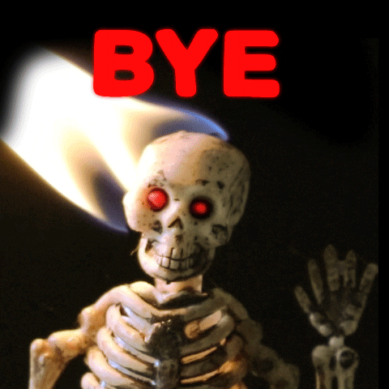

# LGED 21-22 Week-7 Recap: The Halfway Point Filled with Injuries and Byes

### Whaddup

A low scoring output this week by the LGED. Teams are injured and the week 7 byes were no joke. A lot of teams couldn’t even start full rosters.

Whether it's poor drafting, questionable waiver pickups or you let OJ GM your team, it was brutal out there this week.

We sit at the halfway point. A lot more regular season left. So get those waiver claims in, turn on those push notifications and on Sunday, refresh those ESPN apps constantly. It’s gonna be a good second half.

On to the matchups.

 
 
 

| W  | | L   |   |
| ------------------------ |:-------------:| --------------------|:----------:|
|     **Im just … Tired**      |**95.94**     | Carroll’s A Coward|   73.04  |

Let’s gooooooooooo! Eugene finally gets his first win of the season. It did take half the regular season to get here but he’ll take it. Kyle on the other hand drops his second game in a row. Eugene should change his name to the Waiver All-Stars. D’Ernest Johnson stepped up for the Browns after both their starting RBs went down due to injury. Eugene snatches him up and is rewarded with 146 rushing yards and a touchdown. Devontae Booker doing his part for the Giants with 66 yards from scrimmage and a touchdown. Chuba Hubbard, another waiver wire pick up in previous weeks, had his worst game since starting over Christian McCaffrey with just 7.6 fantasy points. A.J. Brown is finally starting to find a rhythm. Brown’s best game of the season so far with 133 receiving yards and even found the endzone (just his second of the season). The Ravens D/ST really tried their best to keep Eugene tired with -6.0 points. A great win considering no one on Eugene’s bench played either due to injury or byes. It did appear that Kyle was throwing Eugene a bone with one empty RB slot. We’ll have to ask him the reasoning as he did have Myles Gaskin on the bench… but he still would have lost. Zach Ertz was a last minute pickup with Rob Gronkowski being a late scratch and Austin Hooper being locked on the bench for playing on Thursday Night Football. The real story was Patrick Mahomes putting up his second worst fantasy performance in his entire career. Mahomes narrowly beat out his all time low of 7.2 fantasy points back in week 7 of 2019. Even in his first career NFL start ever in 2017, he put up more points (10.36). I definitely expect Mahomes to get back to his old ways, but it's still crazy given how good this guy has been the last few years. Pretty mediocre week for Kyle’s team. Let’s be honest, the real story here is Eugene getting the W. 

 
 

| W  | | L   |   |
| ------------------------ |:-------------:| --------------------|:----------:|
|     **Yoon Pooned**      |**123.18**     |  I need Moore points  |   109.92  |

My team keeps on rolling and has now won 6 straight games. Junghwan took a tough loss to drop to 2 - 5 on the season and last place in the West division. Last week I mentioned the 3 headed WR monster my team has… it’s not true. It’s all Cooper Kupp. Kupp has been rolling the first 7 week of the season. This was Kupp’s 4th game with 2 touchdowns. He’s never dipped below 10 targets and has only dipped below 10 points once (week 4 against the Cardinals, 8.9 fantasy points). Speaking of another touchdown champ, Hunter Henry. Henry has put together 4 straight weeks with a touchdown. Lamar Jackson has a decent game. As long as Jackson continues to tuck the ball and run, he’ll always have a decent fantasy performance. Jason Myers is dead to me. Come on Myers!!! You can’t hit field goals during a bomb cyclone?? (JK… kind of). My team will try and continue the streak next week against OJ is my GM. Junghwan is in a tough spot. He’s not top of the waiver wire list thanks to Eugene’s hot start. So it’s been tough to bounce back. He could have used the help this week from a guy like D’Ernest Johnson. Especially with Junghwan’s main source of points Najee Harris out on bye and Saquon Barkely still injured. Junghwan did snag Darrel Williams, however Williams fell flat as did the rest of the Chiefs offense. Sterling Shepard was a late scratch due to his hamstring. It’s not all bad. Junghwan still can get back in the playoff conversation. Damien Harris is hitting his stride. Harris puts up his best game of the season with 106 rushing yards and 2 touchdowns. Kyle Pitts comes back from bye to put up a season high 163 yards. Junghwan sits only 3 games out of the first spot in the west. If he can put together 2 more wins with Saquon out, when Saquon returns, Junghwan could be wrecking in the playoffs or people’s playoff hopes at least.

 
 

| W  | | L   |   |
| ------------------------ |:-------------:| --------------------|:----------:|
|     **Golladay Inn Express**      |**141.64**     | DK’s Left Calf|   68.24  |

Danny and the squad nab the highest scoring team title on Monday Night Football thanks Alvin Kamara. More on Danny’s performance below Zach’s team lacked firing power and drops to 3 - 4 on the season behind just 68.24 points this week. With Russell Wilson still dealing with his mallet finger, Zach turned to Sam Darnold. Darnold was benched during the Panthers’ loss to the Giants. He did manage to scrape together 2.44 fantasy points?? Should have just played Russ. DeAndre Hopkins continues his “nice” season. Not as explosive as Zach probably hoped for but Hopkins isn’t doing horribly. Who has been great though is Deebo Samuel. If I remember correctly all the hype was behind Brandon Aiyuk as the top guy in SF. Zach saw right through that (or he wasn’t available, you’ll have to ask him) and went for Samuel who is WR5. TE Dallas Goedert does manage to put up a season high 70 yards this week. Everyone else combined did not look too hot. 6 out of 9 starters for Zach’s team combined for just 25.44 points. Like other GMs, byes and injuries hit hard this week. Expecting Zach to bounce back for a strong second half of the season.

 
 

| W  | | L   |   |
| ------------------------ |:-------------:| --------------------|:----------:|
|     **Poop AUTO**      |**113.94**     | OJ is my GM|   58.3  |

The Poop AUTO skid is over, Kai ends the 4 game losing streak with a win against this week’s lowest scoring team, OJ is my GM. More on Anil’s record breaking low performance below. Kai’s team came to play this week. Except for Miles Sanders, he stayed at home (3.2 fantasy points this week). Mike Evans caught 3 touchdown passes in the first half and finished the game with 76 yards. Evans’ best game of the season so far. Travis Kelce seems to be just humming along. He’s getting the targets, just hasn’t scored a touchdown since week 5… before that week 2. Marquise Brown recorded a season high 14 targets but only caught 5 of them but did score a touchdown. Brown has had spurts of 2 games with 15+ points, then drops off for one game. Pretty crazy check his points below:

|Week| Points|
|:------:|:--------:|
|    1   |  16.4  |
|    2   |   20.3  |
|   **3**   |   **6.8**   |
|    4   |   17.1  |
|    5   |   29.0  |
|   **6**   |   **5.5**  |
|    7   |   16.5  |
| 8 | 20+???|

Kyler Murray continues his great play. Murray’s 4th game this season with 3 or more touchdowns. Kai is looking to not lose another 4 straight in the back half of the season.

 
 

| W  | | L   |   |
| ------------------------ |:-------------:| --------------------|:----------:|
|     **Smokin’ Herbs :smoking:**      |**105.88**     | Kingdom DooDoo|   102.74  |

This week’s closest matchup. Hilarious roster management from both teams. Matt gets the win over Miles despite Matt only having 7 out of 14 players that weren’t injured or on bye. Ja’Marr Chase must have known Matt’s team was hurting this week and stepped up. The rookie Chase puts up his best game of his young career with 8 catches for 201 yards and a touchdown. Yardage and catch count all career highs. Chase is looking like a threat, too bad this isn’t a dynasty league. Besides kicker Brandon McManus with just 2.0 points, everyone on Matt’s team put up 11+ fantasy points. What I like about Matt’s team this week, it’s full of some slept on players. Now, they may be slept on for good reason, but still. Players like Devonta Freeman, Corey Davis and Michael Pittman Jr. Must have felt good to get the win this week with a squad like that. Miles allegedly received a late push notification that Darren Waller was out Sunday. That said, it did make the matchup kind of fair as both teams didn’t play a TE. Joe Burrow got a boost this week thanks Chase. Josh Allen was on a bye for Kingdom DooDoo and Burrow was a great pickup as he put up a fantasy season high in points. D’Andre Swift also put up a season high behind 144 yards from scrimmage and a touchdown reception, 24.4 points. Derrick Henry threw for a touchdown and ran for 86 yards. King Henry’s 15.4 points is actually his second worst fantasy game of the season so far… crazy. Where Kingdom DooDoo lacked this week were the other subs for players on bye. Miles’ starting WRs combined for just 9.8 points. Chase Edmonds’ volume looked good at the beginning of the season but it has definitely lowered as the season has progressed. Edmonds did record a season high in carries this week with 15, perhaps a good sign. Even though Miles and Kingdom DooDoo didn’t get the win, my guy Younghoe Koo hit a game winner for the Falcons.

 
 

| W  | | L   |   |
| ------------------------ |:-------------:| --------------------|:----------:|
|     **EBDB BnB**      |**120.64**     | Fudge Packers|   90.36  |

Sort of called the loss for Connor last week, excited to see if he finishes 7 - 7. But that’s 4 straight wins for Andrew and EBDB BnB. Andrew now sits in second place in the East Division. The Dolphins duo of Mike Gesicki and Jaylen Waddle did well. These guys’ names combined with the fact that they are on the Dolphins just brings a smile to my face. 29.8 points combined for Gesicki and Waddle. Jonathan Taylor continues to eat for the Colts and EBDB. Taylor has racked up back to back 100+ rushing yard games plus a 4 game touchdown streak. DK Metcalf may have been the only Seahawk to do anything on Monday Night Football. Saints D/ST, who Andrew also has on his team, just clamped up the hawks (in Geno Smith we still unfortunately have to trust). Tom Brady now has thrown 602 touchdown passes. No player has ever thrown over 600.

 Here is the list of the top 10

|Rank| Player| Career Passing TD Count|
|:-----:|:--------:|:----------------------------------:|
|1     |   Tom Brady     |       602         |
|2     |    Drew Brees       |     571         |
|3     |    Peyton Manning        |     539         |
|4     |    Brett Favre      |      508      |
|5     |     Aaron Rodgers       |    427     |
|6     |    Philip Rivers       |        421       |
|7     |    Dan Marino        |        420        |
|8     |    Ben Roethlisberger      |    403        |
|9     |    Eli Manning        |      366       |
|10   |   Matt Ryan        |       359      |
|17| Russell Wilson     |      277  |

Geeeeez and he’s not slowing down. The pattern continues for Connor. A fairly quiet week after his highest scoring title in week 6. Connor went big this week with the Packers and played 3 players from the team. Aaron Rodgers, Aaron Jones and AJ Dil… hold up. Is AJ Dilon’s name also Aar… oh no it’s Algiers Jameal Dilon. So close? Anyways Jones and Dilon combine for only 5.7 points. Rogers on the other hand did well with 274 passing yards and 3 touchdowns 24.66 fantasy points. Connor didn’t find as much Dolphins love with DeVante Parker as he was also a last minute scratch and did not play. Cardinals D/ST and kicker Nick Folk did combine for 25.0 points. RB Elijah Mitchell might be the sneaky waiver wire pickup back in mid september that may give Connor’s team a slight boost. Connor is just another GM hit hard with byes. 

## Highest Scoring Team
**Golladay Inn Express - Danny**\
**141.64 Points**\
**Best Player: Alvin Kamara RB - 28.9 Points**\
Monday Night Football still out here helping GMs win $10\
Alvin Kamara always goes off against the hawks\
This season was no different, Kamara went off for 179 yards from scrimmage and touchdown reception\
Chris Godwin had 111 yards and 1 touchdown on 11 targets\
Jalen Hurts is now QB2 and just behind the only guy in the 600 TD club\
Leonard Fournette is on a 3 week touchdown streak and has been good so far\
Calvin Ridley returned and managed to score a touchdown but just 26 receiving yards\
Jets rookie Michael Carter managed to put together a good game even if the Jets did get rocked by the Patriots, 54 - 13\
Carter was a good pickup off the waiver\
Auto draft always nice to Danny\

 
 

## Lowest Scoring Team
**OJ is my GM - Anil**\
**58.3 Points**\
**Best Player: Ryan Tannehill QB - 19.4 Points**\
Back to back roasts for you and OJ\
I just wanted to take the time to congratulate you for setting a new record low\
Without Ryan Tannehill, your team scored 38.9 points\
Cooper Kupp alone this week was only 6.3 points away from out scoring the rest of your team\
3 teams in the league this week more than doubled your points\
Your team combined for only 101 receiving yards\
That 10.1 fantasy points from receiving yardage alone is just above your team’s half PPR combined score of 8 points (16 receptions total)\
No one caught a TD\
Tannehill was the only one to rush for a TD\
Your kicker Evan McPherson was your second highest scorer with 13 fantasy points\
McPherson almost out scored 5 of your players combined, 13 and 13.5 points respectively\
However, you and everyone else’s bench, remind us that bye weeks can be brutal\
So for that, we thank you.

 
 

#### Good luck in week 8 you fucking degenerates

[HOME](../index.md)

[Week 6](./2021_week6_writeup.md)

[Week 8](./2021_week8_writeup.md)
