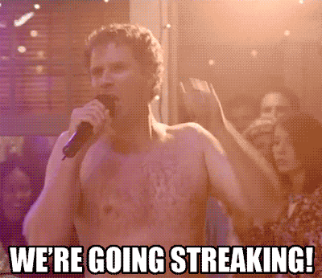

# LGED 21-22 Week-9 Recap: We’re Going Streaking!!! 

### Whaddup

We are back after another unplanned bye week by yours truly. The wife and I went on a trip to NYC and never have I ever seen so many Giants and Jets gear in my life.

8 out of the 12 teams in the LGED are on a streak. Whether a team is winning or losing, a streak is a streak. The lowest streak right now is 3. So, for those 8 teams:

Five more games remain in the LGED 21 regular season. At least half of the playoff spots are still up for grabs. Plenty of time for everyone (except for maybe one team) to make a final playoff push.

Onto the writeup

 
 

| W  | | L   |   |
| ------------------------ |:-------------:| --------------------|:----------:|
|     **EBDB BnB**      |**105.18**     | DK’s Left Calf|   83.72  |

The battle of brothers this week. Andrew wins the battle over Zach in their only meeting this season. Make that 6 straight wins for Andrew and EBDB BnB. Andrew sits just 1 game behind Yoon Pooned for the top spot in the league. EBDB BnB found their stride after dropping 2 straight in week 3. A steady dose of Jonathan Taylor will definitely help. Taylor has been a beast the last 6 weeks. Taylor has averaged 24.47 points in that span. No Tom Brady this week thanks to a bye, but Carson Wentz, Taylor’s buddy, was a good streaming option this week. Wentz happened to put up a season high in fantasy points with 24.18. Amari Cooper and Tony Pollard both were victims of Dak Prescott’s lackluster return from injury. The two combined for just 9.5 points. Continuing the trend of two players on the same team, Mike Gesicki and Jaylen Waddle did well. They combined for 12 catches for 137 yards. No DK Metcalf also thanks to a bye week. That same bye week benched 4 of Zach’s players. Granted Chris Carson is still injured and so is Russell Wilson. In Wilson’s place, Matt Ryan put up 243 passing yards and 2 touchdowns. Matty Ice more than quadrupled his fantasy point output from last week (week 5, 6.14 points). Other than Matty Ice, a pretty low output for Zach and team. Ezekiel Elliot seemed to be the only Cowboy player to be fantasy relevant. The Titans D/ST just shut down Darell Henderson Jr. for his worst performance of the season. Tyler Boyd coming off his best game of the season last week, only managed 1 catch for 11 yards. Deebo Samuel takes a small dip in production with just 5 catches for 63 yards. This was only Samuel’s only 2nd game with under 10 fantasy points. Only 2 players broke over 10+ points this week for Zach. A three game slide has his team sitting in 5th place in the West division, but only 2 games out of a playoff spot. 

 
 

| W  | | L   |   |
| ------------------------ |:-------------:| --------------------|:----------:|
|     **Im just … Tired**      |**94.98**     | Kingdom DooDoo|   61.76  |

Eugene cashes in on his 3rd straight win in a row for 3 total on the season. Meanwhile, Miles and Kingdom DooDoo have dropped 4 straight in a row. Christian McCaffrey returns with a not so first overall pick performance. In his first game back, CMC put up only (lol) 106 yards from scrimmage on 14 carries and 4 catches. Dak Prescott also returned and despite a pretty abysmal performance managed to put up 18.88 fantasy points. Pat Freiermuth came up big with his 2nd straight 12+ point performance. Freiermuth hauled in 5 targets for 43 yards and 2 touchdowns. None of Eugene’s WRs or RBs broke over 55 receiving or rushing yards. Eugene must have done his homework and played the Dolphins D/ST against the Texans. The Dolphins D/ST fantasy points the last 8 weeks combine 13. In week 9 alone? 18 points. Eugene may just be waking up here at a good time. Talk about 2 teams with different momentums. Miles’ squad has lost a few tough ones since week 6. Obviously the biggest loss is Derrick Henry. Kingdom DooDoo lost their king in week 8 because of a broken foot. It doesn’t look like he’ll be coming back this season. Other players will for sure have to step up… but this week they did not. Josh Allen in a surprise loss to the Jaguars. Allen had 3 total turnovers and no touchdowns. Mike Williams has cooled off significantly since week 6. And Chase Edmonds went down during the game with an ankle injury. There are signs of life though. Devontae Booker is on a three game streak with 13+ points. Darren Waller has not been as productive in recent weeks, but this week saw 11 balls being thrown his way. The second most targets Waller has seen since week 1 (19). Miles’ Lions RB due was on bye which usually gives Kingdom DooDoo some fire power as well. Consistency is what Miles will be looking for now that King Henry is out. Let’s see how the kingdom bounces back against a surging EBDB BnB in week 10.

 
 

| W  | | L   |   |
| ------------------------ |:-------------:| --------------------|:----------:|
|     **Poop AUTO**      |**90.86**     | Carroll’s A Coward|   85.74  |

A close win for Kai against Kyle… kind of. Kai decided not to play an RB for some reason. Kyle now has lost 4 straight after winning 5 straight. For Kai’s team an okay performance. Joe Mixon looked over and saw he was the only RB on the squad and put the team on his back. Mixon rushed for 64 yards and 2 touchdowns while adding 5 catches for 46 yards. Mixon’s best game of the season. Marquise Brown continues his great season with 9 catches for 116 yards. Travis Kelce still sits at TE1 and nabs a touchdown after 4 weeks in a row without one. Kyler Murray sat out and in came Matthew Stafford. Stafford had his worst game of the season. If it weren’t for a garbage time touchdown, he would not have broken 10+ points. Bit of a rocky season for Poop AUTO. The last 5 games for Kai are against teams with an under .500 record. Kyle’s team is in a bit of a rut. He still sits above .500 (5 - 4) but injuries have not been too kind. James Robinson didn’t play week 9 and was a last minute scratch. Kareem Hunt is still out as well. Hopefully Rob Gronkowski returns from his bye and produces like he had through the first 3 weeks of the season. Patrick Mahomes the last 3 weeks has not been the MVP of old. This was just Mahomes’ 2nd week without a turnover. DeVonta Smith may be on the come up with his best game of the season. Smith brought in 5 receptions for 116 yards and a touchdown. The Packers need to figure out their COVID situation. Davante Adams pretty much sat out 2 games in a row. Last week, Adams was on the COVID list. This week, Aaron Rogers was on the COVID list. Players like Myles Gaskin (go dawgs) and DJ Moore won’t be able to keep the team a float alone. With Mahomes, Adams and Robinson out or not performing well, points will be hard to come by. I still expect Kyle’s squad to bounce back for a late season push. Either in the regular season or the playoffs. 

 
 

| W  | | L   |   |
| ------------------------ |:-------------:| --------------------|:----------:|
|     **Yoon Pooned**      |**135.04**     | Fudge Packers|   60.5  |

We had the highest scoring team against the lowest scoring team. My team nabs the title this week against “Keep the Streak Alive” Connor and the Fudge Packers. A hollow win for my team and a loss no matter what for Connor. Connor was just 1.21 points away from not being the lowest scoring team. More on both performances below.

 
 

| W  | | L   |   |
| ------------------------ |:-------------:| --------------------|:----------:|
|     **Golladay Inn Express**      |**95.98**     | I need Moore points|   78.44  |

Danny and the Golladay Inn Express continue to roll. 4 straight wins for Danny as he hands Junghwan his 6th loss of the season. Danny now sits at 7 - 2 and on the top of the West division. Players like Alvin Kamara keep the Golladay Inn Express running in tip top shape. Kamara rushed for just his 3rd touchdown this season. He has been steady though averaging 17.8 points a game this season. With Christan McCaffrey out, Kamara may now be the RB king of any form of PPR. Michael Carter for the Jets has been on a reception spree himself. Week 7 and 8, Carter caught 8 and 9 targets respectively. This week though just 1 but still managed 86 yards from scrimmage. Justin Jefferson puts up exactly 15.5 fantasy points for the 2nd time this season. And of course, the writeup's favorite topic for Danny’s team, Jalen Hurts. Hurts still sits at QB2 through 9 weeks. He is averaging 22.1 fantasy points a game this season and has only fallen below 20 points just twice. We’ll see where Odell Beckham Jr. ends up. OBJ and his new team might give Danny’s team a nice boost for the rest of the season. Junghwan can’t seem to string together consecutive wins. He and his team now sit in last place in the West division but that does not mean he’s out of it by any means. QB woes continue for Junghwan. Junghwan has never really had quality QB production. This week was no different as Derek Carr put up his second worst fantasy performance of the season.

**I need Moore points Starting QB Points Week 1 - 9**

|Week|QB| Fantasy Points| Matchup Result|
|:-----:|:----:|:------------------:|:------------------:|
|1| Ryan Tannehill| 14.18| L|
|2| Ryan Tannehill| 14.58| L |
|3| Daniel Jones| 16.54| L |
| **4** | **Daniel Jones** | **26.78**| **W**|
|5|Daniel Jones| 4.82|L|
|6|Daniel Jones| 4.08|W|
|7|Derek Carr| 19.02| L|
|8|Daniel Jones| 16.08| W|
|9|Derek Carr| 10.34| L|

A lot of Junghwan’s players have had a bit of a boom or bust feel. Julio Jones, Brandin Cooks and Kyle PItts. All three have had their great games but definitely have had more mediocre games. The consistency of Saquon Barkely is sorely missed. Barkley could be ready to go in the next 2 to 3 weeks. Najee Harris adds to his resume for AFC Offensive Rookie of the Year. Harris put up his 4th rushing touchdown of the season with 73 yards from scrimmage. Darrell Williams has been solid since being the top back in Kansas City. The battle of two 3 - 6 teams next week as I need Moore points faces off against I’m just … Tired.

 
 

| W  | | L   |   |
| ------------------------ |:-------------:| --------------------|:----------:|
|     **Smokin’ Herbs 🚬**      |**103.24**     | OJ is my GM|   71.88  |

Matt gets the win over Anil to remain over .500 on the season so far. Anil on the other hand has now lost 4 straight. For Matt, Justin Herbert snapped back into his dark horse MVP form with 356 passing yards with 2 touchdowns and 1 rushing touchdown. This was Herbert's best game since week 5. Josh Jacobs continues his somewhat quiet season. Jacobs hasn’t broken over 53 rushing yards in the 5 games he's played. This week, he broke that record and rushed for 76 yards but no touchdown. Michael Pittman Jr. is on a nice 3 game touchdown streak. Pittman has been good so far and currently sits at WR9. Ja’Marr Chase’s worst game in his young career with only 6 catches for 49 yards. Funny because it was Chase’s highest number of targets this season. Dalvin Cook’s rocky season continued but did manage 110 rushing yards. It looks like both Anil and OJ went on a trip this week without letting the other one know who would be setting the team’s lineup. Antonio Gibson and T.J. Hockenson were both on byes. Kirk Cousins rushed for his first touchdown of the season and also managed to throw for 2 more. Keenan Allen enjoyed Herbert’s return to form and caught 12 passes for 104 yards. Fellow offensive coworker Austin Ekeler sits at RB4 on the season but didn’t make much of an impact this week. Allen Robinson hasn’t scored over 10 fantasy points this season. Devin Singletary did have his second best fantasy game of the season thanks to 7 receptions. Singletary found some production in an otherwise very forgettable offensive performance by the Bills against one of the worst teams in the league. Doesn’t look like Anil would have won even if he did start his lineup, but you never know. 

 
 

## Highest Scoring Team
**Yoon Pooned - Mike**\
**135.04 Points**\
**Best Player: Lamar Jackson QB - 30.64 Points**\
My second time being the highest scoring team\
This now puts Andrew, Kyle and myself in a three way tie for the most number of times being the highest scoring champion\
An 8 game streak for Yoon Pooned\
Lamar Jackson was running wild for a season high in rush yards, 120\
Nick Chubb said bye bye to Odell Beckham Jr. with 137 rushing yards and 2 touchdowns for his best game of the season\
Cordarrelle Patterson has been my best waiver wire pickup and sits at RB7\
Tyreek HIll and CeeDee Lamb were a bit quiet with just 60 receiving yards combined\
And of course, Cooper Kupp despite a bad outing from Matthew Stafford still has 11 receptions for 95 yards\
Still praying this moment continues for the rest of the regular season and into the playoffs

 
 

## Lowest Scoring Team
**Fudge Packers - Connor**\
**60.5 Points**\
**Best Player: Robert Woods WR - 13.9 Points**\
Connor’s second time as the lowest scoring team\
Tyrod Taylor was a bold choice since he hadn’t played a game since week 2\
Surprise, Taylor had 3 interceptions\
Sadly, Taylor had more rushing yards than one of your RBs, Zack Moss\
Just like yourself, Aaron Jones was also missing Aaron Rogers bad\
Your team is pretty much a Green Bay Aaron stan account\
Adam Thielen, who isn’t an Aaron, is the only one on your team to score a touchdown\
Your bench with just a D/ST and one RB scored more than a third of your starting lineup’s points\
Might be some more help on the bench in Michael Thom… never mind [I guess he’s out for the season](https://twitter.com/Cantguardmike/status/1455895624742748161?s=20)
 
However, you did continue your streak of L W L W L W L W L and you remind us to just take a step back and laugh at fantasy football\
So for that, we thank you.

 
 

#### Good luck in week 10 you fucking degenerates

[HOME](../index.md)

[Week 7](./2021_week7_writeup.md)

[Week 10](./2021_week11_writeup.md)

