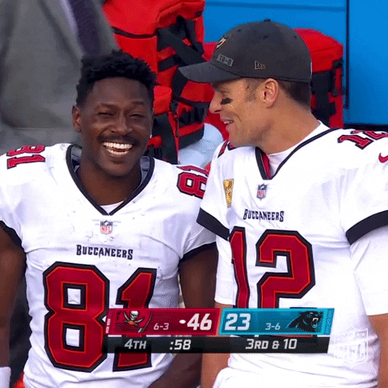

# LGED 2020 Week-10 Recap: Outlandish Playoff Scenarios Begin to Fill GM's Heads

### whaddup

Only 3 more weeks left in the LGED 2020 Regular season. A few reminders:

 - Trade deadline is November 27th
 - Top seeds in each division get into the playoffs with a first round bye
 - The last 4 spots are filled out by overall record regardless of division
 - Tiebreaker for playoff spots are points for 

If you have any last minute trades let me know and I can punch them through.

Week 10 brought five teams in the forefront for the last four playoff spots. Handful of teams still have a shot and are not backing down. Also, a long streak finally ends and in somewhat exciting fashion.

And now, week 10.

| W   |   | L    |    |
| ------------------------ |:-------------:| --------------------|:----------:|
|     **Smokin’ Herbs**      | **101.3**  |  EBDB BnB |   92.58  |

Matt keeps the good times rollin with a win over Andrew’s EBDB BnB. Not a good time to pick up two straight losses with five teams sitting at 6 - 4. There’s a chance EBDB BnB won't make the playoffs. Matt continues his waiver wire magic with his latest pickup Wayne Gallman. Gallman has been the lead back for the Giants in the last few weeks. Gallman has four straight weeks with rushing TDs. This week, Gallman scores two touchdowns with 60 yards from scrimmage for 18.5 points. James Robinson rushes for 109 yards and hasn’t dipped below 10 points since week 5. Michael Thomas needs to play more like Terry McLaurin. McLaurin this week scored one less point than Thomas has for the season (13.7 for McLaurin this week and 14.5 for Thomas this season). Back to back under 100 point performances for Andrew and two straight Ls. DeAndre Hopkins had a hell of a catch for the hail mary winner against the Bills. That catch alone gave Hopkins 10.8 more fantasy points. Adam Thielen’s rollercoaster season continues but this week was better with 18.3 points. Kareem Hunt is still finding production with the return of backfield mate Nick Chubb. Ryan Tannehill and the Titans are in a bit of a slump. It would be fun to watch EBDB BnB miss out on the playoffs... but Ezekiel Elliot was on bye, Antonio Brown is starting to find his role in Tompa Bay, and Tua Tagovailoa could replace Tannehill at this point. EBDB BnB could return to winning form.

| W   |   | L    |    |
| ------------------------ |:-------------:| --------------------|:----------:|
|     **Poop AUTO**      | **124.16**  |  Yoon Pooned |   110.12  |

Game went down to the wire. While everyone was raving about Kyler Murray’s hail mary game winner to DeAndre Hopkins, Kai was raving about Josh Allen’s TD pass to Stefon Diggs. That play sealed the deal for Kai’s team to pick up the win against Yoon Pooned. Alvin Kamara was also putting up the numbers behind three total TDs. Kamara had 83 receiving yards with just 15 rushing yards. Back to the Bills, Josh Allen and Stefon Diggs combined for 47.16 points. Mike Davis returns to Poop AUTO and is just as productive as he left, 6.4 points. Davante Adams cooled off a bit but still found the endzone, 14.6 points. Poop AUTO may need some help at the flex and TE slots, but there’s some help on the bench. After a short winning streak, my team couldn’t get it done. Saints D/ST and Ryan Succop combined for 32 points which is the most production I’ve gotten out of those slots combined this season. Will Fuller V’s glorious touchdown streak ends this week and scores under 10 points for just the second time. Derrick Henry may not have got a rushing TD, but Jonnu Smith did. DeeJay Dallas took a surprising back seat to Alex Collins for the hawks. I can’t wait for Chris Carson to return. Keenan Allen salvaged his performance with a late game TD grab. The loss puts me back in line with the other playoff hopefuls.

| W   |   | L    |    |
| ------------------------ |:-------------:| --------------------|:----------:|
|     **Catch 22**      | **119.0**  |  OJ is my GM |   71.52  |

Eugene’s team has also found success with waiver wire pickups. With injuries and byes this week, Eugene managed to put a team together to get the win. Of course, it does happen against the lowest scoring team this week. After beating the lowest scoring team last week, Anil and OJ are the lowest scoring team this week. More on their performance below. Nyheim Hines lit up the Titans on Thursday Night Football behind 115 yards from scrimmage, one rushing and one receiving touchdown, 26 points. Diontae Johnson has his second best game of the season, 20.6 points. Chris Godwin caught all six of his targets for 92 yards. Kyler Murray continues his spectacular fantasy season. Murray has just one week, week 4, where he hasn’t rushed for a touchdown. This week, Murray rushed for two. Christian McCaffrey is still hurt and may be for another week. Look out once he’s back.

| W   |   | L    |    |
| ------------------------ |:-------------:| --------------------|:----------:|
|     **The Shady Bunch**      | **142.24**  |  Carroll’s A Coward |   88.82  |

There is a scenario for Connor to reach the playoffs and a win over Kyle this week was a step in the right direction. On top of that, The Shady Bunch scores big and is the highest scoring team of the week. For the second time this season, see Connor’s performance below. The week 10 bye weeks weren’t kind to Kyle. Amari Cooper and Calvin Ridley were on vacation this week. A.J. Green tried his best for 0 points. John Brown tried as well and was more successful, 10.2 points. Colts D/ST continues their success with their fifth week with 10+ points. Ronald Jones II ripped off a 98 yard touchdown run and totaled 192 rushing yards for the game. Kyle is now 1 - 4 in the last five weeks. He’ll need to find success quick to secure a playoff spot. Next week comes Poop AUTO who is also hungry for the playoffs.

| W   |   | L    |    |
| ------------------------ |:-------------:| --------------------|:----------:|
|     **DK’s Left Calf**      | **100.42**  |  Kingdom DooDoo |   92.96  |

What a win, Zach and his team pick up their first win since week 1. To add to the excitement, Zach hands Miles and his kingdom a loss and possibly his shot at the playoffs. Zach still couldn’t nail down which of his three QBs to play. Miles Sanders is back and had a good game with 95 yards from scrimmage for 12.5 points. JuJu Smith-Schuster with back to back great games. 18.2 points this week and 18.3 points last week. Tee Higgins has his best game of the season with 19 points. Higgins has only scored less than 10 points three times this season. Matt Prater hits a game winning 59 yard field goal to cap off 16 points. Zach is still around and wants to ruin your season. Kingdom DooDoo was without their knight in shining red armor, Patrick Mahomes. Derek Carr comes in off Miles’ bench and puts up 7.16 points. The Raiders scored 32 points against the Broncos… Carr was just there to hand the ball off. Mike Evans and Rob Gronkowski both scored touchdowns for the Buccaneers to combine for 28.8 points. J.D. McKissic has his best game of the season with 14.4 points. Cole Beasley made up for his lack of slot production last week to come up with four times the fantasy points this week, 22.4. Miles’ has a shot at the playoffs, just needs to win out and hope a few other teams fallout. 

| W   |   | L    |    |
| ------------------------ |:-------------:| --------------------|:----------:|
|     **2 Girls 1 Kupp**      | **102.18**  |  I need Moore points |   97.84  |

Danny’s 2 Girls and 1 Kupp continue their winning streak. The streak is now at six. Tough loss for Junghwan. Dalvin Cook’s performance on Monday Night Football sealed the win for Danny. Cook didn’t have his normal monster game, but still managed 13.2 points which is all Danny needed. Cook’s first game this season without a touchdown. Antonio Gibson picked up the slack with two touchdowns for 20.5 points. Lions’ Marvin Jones Jr. enjoys the quiet life and his highest receiving yards in a game and highest fantasy points (96 receiving yards and 19.6 points). Let’s see how far Danny can carry this winning streak, he sits at 6 - 4. Junghwan falls to 4 - 6. Playoffs are still there for him as the top spot in the West division looms. Josh Jacobs knew the importance of the game for Junghwan and put up 136 yards from scrimmage and two touchdowns. Drew Brees got hit hard against the 49ers and left the game early. Travis Fulgham has his worst game of the season. Brandon Aiyuk continues his success with the 49ers despite no Jimmy GQ. Definitely needed Moore points this week with Tyreek Hill and Todd Gurley II on bye. Keep an eye on Junghwan’s squad and don’t count him out just yet.

## Highest Scoring Team
**The Shady Bunch - Connor**\
**142.24 Points**\
**Best Player: Tom Brady QB - 31.84 Points**\
Your third time scoring over 140 points\
The squad is finally looking healthy as well\
Nick Chubb returns with 126 rushing yards and a touchdown, 18.6 points\
Aaron Jones has been back and is producing good numbers with no touchdowns\
D’Andre Swift with his second 20+ point performance this season\
Chase Claypool got in on some of the Steelers WR action\
Only two of the Shady Bunch scored less than 10 points: Tyler Lockett with 9.1 and Jimmy Graham with 0\
Tom Brady bounces back big with 29.48 points more than last week\
With a fully healthy squad, Connor is looking to make a playoff run and make some more cash.

## Lowest Scoring Team
**OJ is my GM - Anil**\
**71.52 Points**\
**Best Player: Justin Jefferson WR - 17.5 Points**\
I’m actually surprised your team managed more than 70 points\
Not a single member of your team scored a touchdown\
Your team did have four total turnovers\
If we added in your bench points, that would still make you the lowest scoring team\
In the last three weeks, Russell Wilson has turned the ball over the same number of times he's scored a touchdown\
Almost a quarter of your points came from Justin Jefferson alone on Monday Night Football\
The bottom four players for your team this week combined were outscored by Jefferson by 1.9 points\
However, you remind us that touchdowns are elusive and can really make a break a fantasy week\
So for that, we thank you.

#### Good luck in week 11 you fucking degenerates

[Back to Archive](../2020_archive_page.md)

[Week 9](./2020_week9_writeup.md)

[Week 11](./2020_week11_writeup.md)
