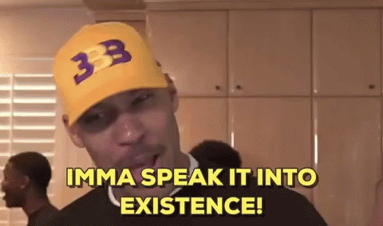

# LGED 2020 Week-5 Recap: One Undfeated Team Remains and Everybody has a Win

### whaddupp

Strange week for games as the waiver wire hit Thursday instead of Wednesday and no TNF for week 6. I shared some updates to the schedule in the league chat but it shouldn’t affect fantasy too much.

This week we saw 2 undefeated teams go down with one reaming. A team becomes the highest scoring team for the 2nd time, while another team is the lowest scoring team for the 2nd time. Trades are happening and I’m loving how active the league is. The waivers are busy and shit is being talked.

Also, **LAAAAAAAAAAAKKKKKKKERRRRSSSS**

Let’s get on to week 5.

| **Yoon Pooned (100.66)** | **100.66**    | Carroll’s A Coward  | 91.1  |
| ------------------------ |:-------------:| --------------------|:-----:|

Back-to-back wins for my squad and Kyle’s first loss of the season. After being the highest scoring team last week, my team came back to earth with some pretty mediocre numbers. Thank god the Titans Bills game actually happened, couldn’t go without my guy Derrick Henry two weeks in a row. Henry found the endzone twice and had a [massive stiff arm on Josh Norman](https://www.youtube.com/watch?v=HBrTsnwQamE&feature=youtu.be). Keenan Allen gave me a TD before leaving the game early with back spasms. Robby Anderson continues to produce and is a top 10 WR so far in fantasy. George Kittle struggled within a sputtering 49ers offense (how much are they paying Jimmy Garoppolo??). Chris Carson is my guy and so far through 5 weeks has been as steady as I would hope he would be. Let’s see how far my team can continue to poon. Kyle had his lowest scoring output this season. Best player this week was Calvin Ridley with 17.6 which is a nice bounce back after his 0.0 last week. Ronald Jones II hits 100+ yards with a handful of catches for the second week in a row. Mark Ingram II, Kyle’s waiver wire pick of the week, didn’t have much success like his backfield counterpart Lamar Jackson… is it time to jump ship and play Deshaun Watson? Probably not, I’m just trying to get into Kyle’s head. In the last 3 weeks, Kyle’s team has scored an average of 27 points from his Kicker and D/ST alone. That is great production in those slots and the funny thing is it’s all Colts. Dak’s injury might have played a part in Amari Cooper’s first game under 13.0 points. Down week for Carroll’s a Coward, but just 1 loss so far.

**Kingdom DooDoo (96.5)** vs Post Mahomes (92.86)\
King DooDoo Miles himself may have caught a spark after last week’s roast, shit is flammable. Despite two players putting up a total of 0.0, Miles finds a way and gets the W over Matt. At least Leonard Fournette was suited up for this game. Scotty Miller just decided he didn’t like Thursday Night Football and was nowhere to be found. But don’t worry, Patrick Mahomes comes up with his second best fantasy performance of the season (29.7 points) to pull some Buccaneers slack. I think Mike Evans likes Tom Brady in Tampa so far and has caught a TD every week. I loved watching the highlights of Myles Gaskin against the 49ers, reminds me of those UW days. Gaskin has been a good pickup waiver wire pickup for Miles who needed an RB. T.Y. Hilton was finally benched but he had his best game of the season! Almost broke double digits in points, 9.9. Injuries and bye weeks were the story for Matt. None, NONE of his players on the bench played this week. He only lost by 3.64 points and I blame Terry McLaurin. We believed in McLaurin coming into week 5, but against the LA Rams, him and the Washington football team didn’t produce. Rookie QB Justin Herbert is looking good out there for the Chargers. Although, Chargers still out there losing games by 1 score and the trend from last season continues. Ravens D/ST came up big with 7 sacks, 1 interception, 2 fumbles recovered and 1 TD as they spanked the Bengals. In the AFC North we are seeing the Steelers and Ravens at the top, classic. Speaking of the Steelers, James Connor’s TD streak continues for the third week. Le’Veon Bell was released but at least he signed with the Chiefs. The dramatic season for Matt continues. He really has seen it all, but Post Mahomes is 2 - 3 with a chance.

**I need Moore points (119.22)** vs OJ is my GM (81.98)\
Junghwan gets his second win of the season over Anil and OJ. Josh Jacobs had his second multi-TD game of the season for 21.5 points. Todd Gurley II heard me talking about him being only a TD guy in fantasy and broke off 121 rushing yards. Gurely’s highest rushing yard total by 41 yards. He also scored a touchdown. Joe Burrow got rocked in Maryland. Burrow fumbled and threw an interception for a total of 4.32 points. Tyreek Hill still hasn’t produced that massive game just yet, but he’s averaging 16.46 points through 5 weeks so no one is complaining. Jason Sanders provided Moore points with 22.0, dude had 5 field goals made and 4 extra points. Junghwan’s defense felt all those as the 49ers D/ST gave him -4 points. Let’s be real though, who is finding any production behind their D/ST slot?? Speaking of finding production at the D/ST slot, Anil and OJ may have come up with a new strategy for GM’s in the LGED. Don’t even play a D/ST. Anil and OJ put in Broncos D/ST who are on their scheduled bye week. 3 teams would have benefited from this strategy in week 5. Anil and OJ were not one of them as they got the L. Jerrick McKinnon really took a backseat to Raheem Mostert even though McKinnon has looked good for the 49ers. 2020 MVP Russell Wilson, yup, I’m giving him the award now.

Wilson adds 3 more TD’s to his total this season bringing it to 19. Late game heroics, long drawn out post game interview answers, this is it boys, peak Mr. Unlimited. It was Clyde Edwards-Helaire’s first time not reaching double digit points. Anil and OJ traded for Justin Jefferson just in time for him to score 3.8 points. Anil finds his team 2 - 3 under the OJ leadership, Poop AUTO looms in week 6.

**Catch 22 (148.4)** vs The Shady Bunch (89.84)\
For the second time this week, Eugene is the highest scoring team of the week. Pissed he took Younghoe Koo from me but I know he’s loved and possibly obsessed over on Eugene’s team. More on Catch 22’s performance below. Connor follows up his first win of the season with a loss to the highest scoring team. Seems like Connor still has a bit of bad luck with him. Devonta Freeman played his best game of the season with 87 yards from scrimmage and 1 TD. I didn’t know the browns placed Nick Chubb on IR and a bye week for Aaron Jones left Connor with little choices at RB. Tyler Lockett has been a bit in DK Metcalf’s shadow the last two games making decisions tough for Connor. To choose between Lockett, CeeDee Lamb, and DeVante Parker is a decision at WR I’m happy I don’t have to make. With Chubb out for 6 weeks, Connor may need to make some drastic moves to get into winning form again. At least he’s finding success behind Greg Zuerlein and Rams D/ST who combined for 28 points.

**2 Girls 1 Kupp (93.94)** vs DK’s Left Calf (73.54)\
Ayyyyye there it is! Danny’s first win of the season. A bit of good luck this time around as Zach’s team is the lowest scoring team of the week. This is the second time Zach has found his team getting roasted, you can find it below. AJ Green? Julio Jones? 4 years ago we would have all been raving if we had both on our team. Danny got the win with neither of them this week. Jones is out and Green had a hamstring injury during his game. Dalvin cook also got injured but manged to put up 17.4 points. Cook so far is the second ranked RB, hopefully he can come back healthy soon. Mike Davis is loving the limelight. Davis has put up 19+ points every week since he has been the number 1 RB in Carolina. Matt Ryan on the other hand is looking a little sorry. With a promising start to the season, he just hasn’t found his stride. Newly acquired Anonio Gibson puts out his second worst performance. Nonetheless, Danny has his first win and hopes his bad luck is done. 

**EBDB BnB (138.54)** vs Poop AUTO (105.82)\
Both these teams coming in undefeated, someone had to lose. Kai didn’t really enjoy his stay at EBDB BnB as he loses this match by 32.72 points. Andrew and his BnB rolls on. His team has been in the highest scoring team 2 times, the 2nd highest scoring team 2 times, and the third highest 1 time. I hate to say it but Andrew has good production in every slot and hasn’t dealt with any injuries… until now. Dak Prescott left his game with a broken ankle. Tony Romo thought he was cramping. Prescott’s season was great, he was on pace for around 6,700 passing yards. Through weeks 2 - 4 he was averaging 475 passing yard per game. The silver lining for Andrew’s team was that he didn’t draft Prescott in round 1. With DeAndre Hopkins and Adam Thielen popping off for 20+ points each, EBDB BnB doesn’t have much to worry about. Kareem Hunt with 16.8 this week and the injury to Nick Chubb is somehow the fantasy gods saying sorry for the Prescott injury??? Ezekiel Elliot will continue to eat and probably a lot more. Someone give EBDB BnB an L. Kai didn’t have a bad week. There were only 2 other teams he would have lost to this week. Josh Allen may have been spooked by COVID as he and the Bills played the Titans on Tuesday night. Allen had his worst game of the season where he threw 2 interceptions. Alvin Kamara followed suit with his worst game but with 14.4 points, ahhh life as the number 1 RB in fantasy. DJ Moore finds the endzone for the first time this season to cap off a 17.3 point performance. Stefon Diggs wasn’t as spooked by COVID and caught the ball 10 times for 106 yards. Nothing to fret about for Poop AUTO. Davante Adams should be returning from his injury and a bye week. One loss never hurt anyone right?

## Highest Scoring Team
**Catch 22 - Eugene**\
**148.4 Points**\
**Best Player: Kyler Murray QB - 26.3 Points**\
Wow, no huge break out performance, just 5 players scoring over 20 points\
Those 5 players alone would have beat over half the league (7 teams to be exact)\
Jamison Crowder has been the only shining light for the Jets and with just 3 games is the 23rd WR in fantasy\
DK Metcalf has been playing like a stud so far this season and has only dipped below 17 points once (go hawks)\
Injuries to Christan McCaffrey and Chris Godwin don’t show at all\
Darrell Henderson Jr. will be a slight gamble in that RB committe in LA, but it paid of this week\
Things are looking good for Eugene, lucky for us he’s only 3 - 2

## Lowest Scoring Team
**DK’s Left Calf - Zach**\
**73.54 Points**\
**Best Player: Miles Sanders RB - 22.9 Points**\
Again with the playing of an inactive player, this time Zack Moss\
I get it, same first name but come on\
Your most targeted player in the passing game this week was Joe Mixon RB\
Your WRs combined only caught 1 more pass than Mixon did\
Mixon only had 12.4 points\
6 players combined for 18.4 points… your bench with just active players scored 27.6\
Those 2 players if played would have won you the game AND saved you from lowest scoring this week\
If you hadn’t played Moss and played either of the two active players on your bench instead, you would have saved yourself from getting roasted again\
In the last roast, you reminded us that we had to manage ebbs and flows… this is one of those times you need to manage\
However, you remind us this week to know who on our roster is playing and who is not\
So for that, we thank you.

#### Good luck in Week 6 you fucking degenerates.

