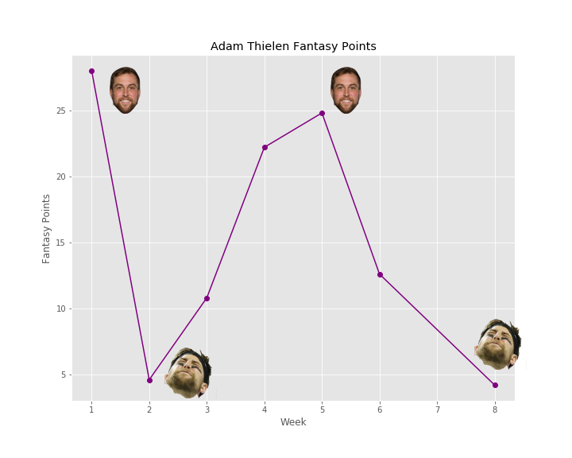

# LGED 2020 Week-8 Recap: Forget Club 4 - 2, Club .500 Babyyyy

### Whaddup

We are back. Much needed bye week around the mid way point. Things are starting to heat up in the battle for the playoffs. The field is pretty even with one team closing in on clinching a playoff spot. We have six, SIX teams at 4 - 4. That’s half the league.

Shout out to Connor and The Shady Bunch for being the highest scoring team for week 7. Not only Connor’s first of the season but for his time in LGED. 

Week 8 brought some pretty mediocre scores across the board. Only one team managed to get over 110 points.

Let’s dig into week 8

| W  | | L   |   |
| ------------------------ |:-------------:| --------------------|:----------:|
|     **EBDB BnB**      |**105.52**     |  Carroll’s A Coward|   71.02   |

Damn. Andrew is running the ENBDB BnB to a 5 star rating. Andrew remains undefeated thanks to the lowest scoring performance of the week from Kyle. Kyle’s first time getting roasted this season. More on the performance below. Someone please stop EBDB. The closest Andrew and his squad got to losing was week 4 against The Shady Bunch where Andrew won by 3.4 points. Through 8 weeks, Andrew has won by an average of 22.47 points. Even though DeAndrew Hopkins was on bye, Andrew’s wide receivers were still the stars of the show. Robert Woods and Corey Davis combined for 47.7 points. Ryan Tannehill has served as a good replacement to Dak Prescott. Tannehill hasn’t dipped below 17 points and has thrown at least 2 TDs in every game EBDB has started him. Ezekiel Elliot is on a three game TD drought no thanks to the actual Dak Prescott replacements. Adam Thielen is the definition of a roller coaster season. Here are his points for the last 8 weeks, he had a bye in week 7:

At this point, I could care less if EBDB BnB continues to win. At least he hasn’t won $10 in a while. We’ll see you come playoff season.

| W   |   | L    |    |
| ------------------------ |:-------------:| --------------------|:----------:|
|     **Yoon Pooned**      |**100.10**     |  Catch 22 |   90.96   |

My team captures the win on Monday Night Football thanks to Ryan Succop hitting a handful of field goals and extra points. Both Eugene and my team came into week 8 at 4 - 3. For now, my team gets the win and the slight edge over the cluttered playoff picture. Despite two lost fumbles and two interceptions, Jared Goff managed to put together 10.2 points on 61 pass attempts. Derrick Henry’s double TD streak ended week 7, but has still managed to score at least one TD a week since then. Even when the Titans are down, they still run the rock with my guy. With Chris Carson out, Carlos Hyde was picked up as his replace… nevermind he also was out with a hammy injury. Devin Singletary was called up to the starting roster and had his best game in 4 weeks with 9.7 points. Keenan Allen seems to be Justin Herbert’s favorite target with a team high 11. Allen also found the endzone to cap off a good week. Tyler Boyd’s first week starting on Yoon Pooned after trading for him. Boyd has done well with another rookie QB under center and has caught a touchdown in back to back weeks. Wasn’t all good news as George Kittle left the game against the hawks (go hawks) with a foot injury. He is expected back in 8 weeks… soooo week 17ish? Nice. Eugene’s team was also hit with a 49ers injury as Jimmy Garoppolo’s ankle continued to mess with him. He left the game and Eugene’s team with 1.76 fantasy points. Kyler Murray was missed as he was on bye. DK Metcalf had his best game of the season with 161 yards on 12 catches and two TDs, 34.1 points (go hawks). Boston Scott wasn’t the hero he was last week for the Eagles or Eguene’s team but had a solid outing. Travis Kelce continues his run as the number one TE in fantasy, I doubt anyone is catching him. Another 100+ yard game and a TD for Kelce. Kelce has four games this season with at least 19 points. Eugene can’t wait til one of his players comes back for injury. Christian McCaffrey, Chris Godwin, Raheem Mostert… any of one of them would help. Carroll’s A Coward is next for Eugene and Catch 22. 

| W   |   | L    |    |
| ------------------------ |:-------------:| --------------------|:----------:|
|     **2 Girls 1 Kupp**      |**132.64**     |  Smokin’ Herbs |   71.82  |

What a surge by Danny’s team. With four losses to start the season, Danny has now ripped off a four game winning streak. To cap off his run to .500, he is this week’s highest scoring team. More on Danny’s performance below. Matt and the new team name Smokin’ Herbs was just 0.8 points from being the lowest scoring team. Goose eggs from Nelson Agholor and Richard Rogers. Le’Veon Bell’s second week as a Kansas City Chief and he may still be learning the play book. Bell had the same number of carries he saw in week 7 but also caught three passes for 31 yards. Scotty Miller was given plenty of deep ball opportunities on Monday Night Football but couldn’t real one. Justin Herbert continues his push for the AFC offensive rookie of the year. The last four games, Herbert has thrown 13 touchdowns and rushed for one with only three interceptions. Phillip Lindsay puts up his best game of the season with 83 yards on six carries and one touchdown, 15.1 points. I’m not sure if Michael Thomas is still on planet earth, but Matt’s team needs help at the WR slot. Matt’s starting WR combine, 5.7 points. Of course, our guy Terry McLaurin was on bye which didn’t help either.

| W   |   | L    |    |
| ------------------------ |:-------------:| --------------------|:----------:|
|     **OJ is my GM**      |**106.64**     |  DK’s Left Calf |   89.74  |

Anil snags the win against Zach. With this latest win, Anil’s last five matchups have resulted in W, L, W, L, W. Anil’s whole bench this week was either out or injured. 2020 MVP Russell Wilson continues to ball out and has yet to put up a game of less than 20 points. Eagles D/ST dominated the poor Cowboys with a safety and a touchdown for 21 points. Clyde Edwards-Helaire had the same number of carries as new backfield mate Le’Veon Bell… Bell managed more points in fantasy than Edwards-Helaire. Jerick McKinnon is one of a million RBs to play for the 49ers. McKinnon actually recorded -1 yards rushing but did rush for a touchdown and had 40 receiving yards. Allen Robinson sits at fantasy WR number 11 through eight weeks. Robinson is definitely the guy in Chicago… possibly the only guy. Anil’s New York Giants tandem of Evan Engram and Darius Slayton are putting up solid numbers (17.6 combined points). Who says the Giants’ offense is trash?? Things are looking good for Anil and OJ. We’ll see if he can string together back to back wins. Zach’s team only has one player over 15 points this week. Giovani Bernard took advantage of Joe Mixon being out with a multi TD game for 21.3 points. Unfortunately, Bears D/ST and Matt Prater were lacking a bit with a total of 2 points. Zach’s roster is still full of QBs. This week Zach chose to start Teddy Bridgewater who turned out to play the worst out of the three QBs Zach has. Jared Cook is on a three game TD streak and puts up his best fantasy performance of the season, 13.6 points. David Montgomery has been solid. Montgomery’s lack of touchdowns is what’s hurting him. He only has one rushing touchdown and one receiving touchdown on the season. It isn’t too late for Zach. If he can finish out the season perfect, there is a chance a six win team gets into the playoffs.

| W   |   | L    |    |
| ------------------------ |:-------------:| --------------------|:----------:|
|     **Kingdom DooDoo**      | **102.84**  |  Poop AUTO |   91.72  |

Kingdom DooDoo? Maybe Miles should change the name to Buccaneers Kingdom. This matchup was all decided on Monday Night Football. Mile’s squad had three Tampa Bay players slotted to make up at least 17.58 points against Kai. Kai had the Buccaneers D/ST. Miles got those points and then some. Miles benefited from both Buccaneer touchdowns with Mike Evans and Rob Gronkowski. Evans, Gronkowski, and Leonard Fournette combined for 37.7 points. Of course the King of DooDoo, Patrick Mahomes, goes off this week to claim the number one spot among QBs and fantasy overall. Mahomes threw for 416 yards and 5 touchdowns, 36.6 points. Myles Gaskin (go dawgs) found the endzone for just the second time this season. Now at 3 - 5, Miles has a good shot at making the playoffs with Tampa Bay clicking and Mahomes ballin. Next up is a hot 2 Girls and 1 Kupp. On the other hand, we have Poop Auto and Kai. Kai finds himself the loser of four straight. Alvin Kamara is still playing well with his first 20+ point performance since week 3. Kamara is still the number one fantasy RB. Davante Adams has looked great since his return from injury. Adams has five touchdowns in his last two games. Kai’s other players haven’t performed that well. Josh Allen, who started the season hot, finds himself on the bench for Poop AUTO. Kai started Carson Wentz in his place who did not have a good night on Sunday with only 8.62 points. Mike Davis hasn’t maintained his success prior to Kai trading for him. Jonathan Taylor had his worst game of the season. Hopefully Taylor doesn’t lose his spot as the main RB in Indianapolis. Stefon Diggs continues to… Stefon Diggs. Diggs has been just steady, he only has one game with 20+ points (this week 12.2). Kai, like some of his players, are in a bit of a slump. Pretty crazy how we have one team win four straight to start and lose four straight (Poop AUTO) and one team lose four straight to start and then win four straight (2 Girls 1 Kupp). Hmmm… four losses never… hurt?

| W   |   | L    |    |
| ------------------------ |:-------------:| --------------------|:----------:|
|     **I need Moore points**      | **95.52**  |  The Shady Bunch |   82.26  |

Junghwan gets his second win in a row against Connor and the Shady bunch. Junghwan has fought his way to .500. This week it was Junghwan’s WRs coming through. Tyreek Hill finally has his boom game! Two touchdowns and 98 receiving yards for Hill. Practice squad god Travis Fulgham has cemented his stay in the big leagues. Fulgham has only failed to score a touchdown once since his call up from the practice squad. The Arizona State rookie Brandon Aiyuk with his best fantasy game of the season with 19.1 points. RB Josh Jacobs rushes for 128 yards on 31 carries. Todd Gurley II salvaged a mediocre game again with a touchdown. Gurlely lives and dies by the touchdown more than anyone else right now in fantasy. Wasn’t an amazing week for Junghwan, he may need a few Moore points next week as Poop AUTO comes to town. Connor and The Shady Bunch are trying their best with some injuries to some key players. Jamaal Williams was a good pickup after Aaron Jones was injured. D’andre Swift couldn’t produce as well as he did last week and has his second worst game of the season. Tyler Lockett (go hawks) took a back seat roll after his monster game last week. Only Devante Parker found the endzone outside of QB Tom Brady. It wasn’t the normal spell of bad luck for Connor this week. A single touchdown could have swung this matchup in his favor. WR roulette will continue for Connor. Hopefully, some of his RBs will get healthy for a second half play off push. Connor has Yoon Pooned next, anything is possible.

## Highest Scoring Team
**2 Girls 1 Kupp - Danny**\
**132.64 Points**\
**Best Player: Dalvin Cook RB - 47.6 Points**\
What a way to cap off a 4 game winning streak, more to come no doubt\
You have added Damien Harris twice off waivers, maybe he is here to stay now with his best game of the season 16.2 points\
The real story here is Dalvin Cook\
Cook got injured, rested up with a bye week, then exploded for 226 yards from scrimmage and FOUR touchdowns, 47.6 points\
Matt Ryan seems to have broken out of his slump and has returned to solid play\
Julio Jones is loving it with his second 137 yard game of the season\
AJ Brown has been killing it as of late and a big reason Danny’s team has gone on this streak\
Kenny Golladay put up 0.0, but Danny’s team still managed to score the highest\
Excited to see how long this streak will go\

## Lowest Scoring Team
**Carroll’s A Coward - Kyle**\
**71.02 Points**\
**Best Player: Tie - Colts D/ST and Michael Badgley K - 15.0 Points**\
Welcome\
Lamar Jackson had twice has many turnovers as touchdowns\
Matter of fact, your team had more fumbles lost than touchdowns scored\
No one besides Lamar even scored a touchdown\
Amari Cooper had one catch\
AJ Green had two catches\
Tevin Coleman had three carries\
Tevin Coleman, AJ Green, and Amari Cooper combined barely out scored your bench: 5.9 to 4.7\
At least your team is somewhat consistent at the D/ST and K slots\
Take away those two slots and you scored 41.02\
That’s 6.58 points less than Dalvin Cook alone\
However, you remind us that having solid play at D/ST and K slots is crucial to not completely bombing\
So for that we thank you.

#### Good luck in week 9 you fucking degenerates

[HOME](../index.md)

[Week 7](./2020_week7_writeup.md)

[Week 9](./2020_week9_writeup.md)

