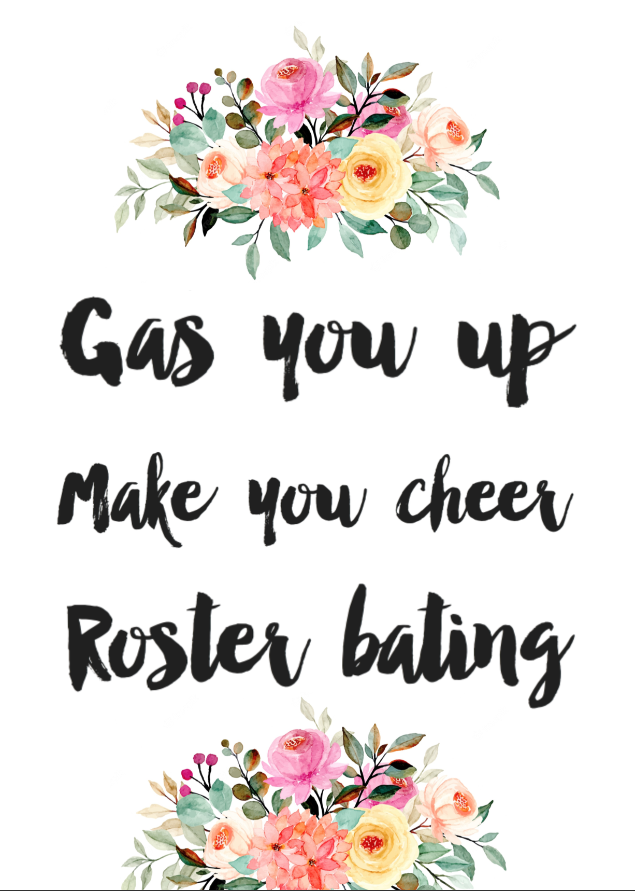

# LGED 22-23 Week-1 Recap: Aahhhhh the Smell of Week 1 is in the Air

### Whaddup

LGED Season 5… I can’t believe we are entering our 5th season. Quick shoutout to my fellow degenerate GMs in the league, let’s keep this going.

The hype of week 1 speaks for itself. It can gas you up, make you cheer and have you roster bating. Sort of a weird version of live laugh love… fantasy football style.

I’m rambling.

Let’s get to it, happy week 1

| W  | | L   |   |
| ------------------------ |:-------------:| --------------------|:----------:|
|     **Conner Cooks KuppCakes**      |**84.3**     | Carroll’s A Coward|   81.98  |

This week’s closest matchup. Connor and his cakes take a week 1 victory over Kyle. It was a close matchup going into Sunday Night Football. Both teams were looking for their fellow Cowboys to guide them to victory. For Connor, it started with the Kupp. Cooper Kupp starts the season where he left off with 128 yards on 13 catches and a TD. Kupp accounted for 45% of Matt Stafford’s completions. Stafford, who also is Connor’s QB, had quite a dud of a game with 3 INTs. James Conner just pounds the endzone and was really the only thing that looked good for the Cardinals (go hawks). But back to Sunday night. Ezekiel Elliot managed to scrounge together 5.4 points to keep Connor’s lead over Kyle for the W. Points for Connor and his cakes were left on the bench. I expect Connor to redo his frosting for week 2. CeeDee Lamb couldn’t seal the deal for Kyle. The Cowboys were the only team not to score a TD in week 1, and Kyle felt that. Ja’Marr Chase should have had at least 2 more touchdowns (watch the [Steelers Bengals highlights](https://www.youtube.com/watch?v=XkgLk02XC4M) if you haven’t) Other than Chase and Dolphins D/ST, no one on Kyle’s starting roster had over 10.5 points. I see a little bit of RB trouble in Kyle’s future. Even with Lamb’s bad game and Tee Higgins’ concussion, Kyle’s team has some depth on the bench at WR. Of course Kyle has Russell Wilson with his team name. Let’s riiiiiiiiiiide

| W  | | L   |   |
| ------------------------ |:-------------:| --------------------|:----------:|
|     **Koo Kicks Clan**      |**135.12**     | I Should Have Autodrafted|   64.76  |

KOOOOOOOOOOO What a start for Youngh.. I mean Eugene’s team. Big week 1 win over Danny as Eugene more than doubles Danny’s points. Danny is the lucky team to get this season’s first Lowest Scoring Champ title. More on Danny’s low bar setting performance below. Big games from Eugene’s top picks. Eugene misses out on the Highest Scoring Champ title by just 0.58 points. D’Andre Swift and Davate Adams combine for 50.01. Special teams doing the heavy lifting with Younghoe Koo and Bills D/ST combining for 36 points. Lamar Jackson gave a middle finger to no contract and put up a decent game with 213 yards and 3 TDs. His accuracy was a bit off (56% completion) and he did manage to throw an interception. The rest of Eugene’s team only combine for 28.8 points which is a little worrying. I don’t think he’ll lose any sleep though as it’s a strong week 1 for Koo Kicks Clan.

| W  | | L   |   |
| ------------------------ |:-------------:| --------------------|:----------:|
|     **I need Moore Points**      |**135.7**     | Kingdom DooDoo|   90.16  |

DOES HE NEED MOORE POINTS?? Junghwan is this week’s Highest Scoring Champ. Yes it was just by 0.58 points but who’s keeping track? Always good to get some of that money back early. More on Junghwan’s performance below. Miles and Derrick Henry have once again taken the iron throne in Kingdom DooDoo. Will this year’s reign be any different from last? If it ends like it did last season for Miles and the final season of Game Of Thrones, it’s not looking good. JK JK, I kid… It’s week 1. King Henry had a solid start for his 2022 campaign with 82 yards and managed [to get blown up](https://www.youtube.com/watch?v=2Pi1vJ-INso).Rashaad Penny had good runs but the holding calls sent him back a few times. Michael Pittman Jr. appreciates Matty Ice. Pittman Jr. hauled in 9 of 13 targets for 121 yards and a TD. Miles had some woes this week with 4 of his players combined to score just 14.4. That group includes the Hound himself, Evan McPhearson. We’ll see what happens in the next episode when DK’s Left Calf marches in to Kingdom DooDoo.

| W  | | L   |   |
| ------------------------ |:-------------:| --------------------|:----------:|
|     **DK’s Left Calf**      |**134.52**     | OJ is my GM|   66.3  |

Zach hands Anil and OJ a big L in week 1. Zach may need to change his team name to Justin Jefferson’s Left Calf after that performance. Jefferson led all WRs in week 1 with 34.9 points. A whopping 184 yards (mostly in the first half) and 2 TDs. After the game, [Jefferson was surprised he was left so open](https://www.espn.com/nfl/story/_/id/34575777/minnesota-vikings-wr-justin-jefferson-career-best-184-receiving-yards-surprised-open-looks-green-bay-packers). Clyde Edards-Helaire started his 2022 campaign off with 2 receiving TDs. The Steelers D/ST had a beat on the Bengals’ with 4 INTs and 1 blocked extra point to send it into overtime (again… watch the highlights from that game). Unfortunately Zach’s QB, Joe Burrow was the one throwing those interceptions but still managed 18.22 points. Keenan Allen left the game with a hamstring injury but had a decent day with 8.6 points. Zach’s current namesake, DK Metcalf, didn’t have a steller game. Metcalf did catch all of his 7 targets for 36 yards but did fumble the ball. Fantastic start for Zach. The same can’t be said for Anil and OJ. Anil did have some trouble logging in to the first few rounds of the draft so we’ll give him that? Only 1.54 points away from being the lowest scoring team this week. Miles Sanders was Anil and OJ’s best player with 17.5 points. Only Deebo Samuel, 11.6 points, and Sanders were the only players in Anil’s starting lineup had over 10 points. Aaron Rogers continues to blame his young WR core for his lack of production. Alvin Kamra and Josh Jacobs both had underwhelming starts and combined for just 13.9 points. Some positive signs on Anil’s bench with James Robinson and Tyler Boyd. Boyd may get some more action in the short term as fellow WR Tee Higgins is out with a concussion. George Kittle has started his usual injury filled season early and did not suit up for week 1. No need to hit the panic button, we’ll see what insights OJ has for Anil in week 2.

| W  | | L   |   |
| ------------------------ |:-------------:| --------------------|:----------:|
|     **Poop AUTO**      |**113.02**     | Yoon Pooned|   102.12  |

The only matchup with both teams scoring over 100 points. Kai gets the win over my team. The name Poop AUTO really hits home, win or lose. Poop on teams or get pooped on. This week, the former. Kai for good insurance doesn’t play a D/ST slot to lock in his points at 113.02. A hilarious and good move, however, we all knew the Cowboys weren’t gonna do anything against the Buccaneers D/ST. Stefon Diggs went big in the opening game of the season with 122 yards and a TD. Burning Jalen Ramsey in the process (go hawks). Allen Robinson II was MIA. A.J. Brown must be loving the Philly Cheesesteaks as he hauls in 10 catches for 155 yards. Brown with a much better start to this season than last. His partner in crime, QB Jalen Hurts, rushes for 90 yards and a TD while adding 243 yards in the air. Joe Mixon doesn’t end up finding the endzone but does damage with 145 yards from scrimmage. Zach Ertz gets a consolation TD as the Cardinals get blown out by the Chiefs (go hawks). Unfortunately, that TD pass came from my QB, Kyler Murray. If Kai had played his D/ST, he would have scored 125.02 for the week which is not a bad way to start the season. Next week, two week 1 one stars: Koo Kicks Clan vs Poop AUTO. Par, Norm, standard… synonyms for average which my team was this week. All but one of my starting skill position slots (Darren Waller missed out with 9.9 points) scored 10+ points. Number 2 overall pick, Christian McCaffrey, in this year’s fantasy draft with an underwhelming 13.7. He wasn’t the worst performer out of the top 12 picks but was 4th in the top 5. Again, Kareem Hunt vultures all of Nick Chubbs TDs. You think I would have learned from last season... Terry McLaurin is the definition of steady eddy. Chistian Kirk was a bit of a gamble but did well week 1 with 6 catches for 117 yards. Mind you he was targeted 12 times… just gonna focus on the positives. Bench good luck charm Drew Lock didn’t cut it for me, I’ll need that 5th bench spot ASAP. An average performance in week 1, to me, means nothing. So I’ll wait for week 2 to overact. Week 2, battle of the top 2 fantasy picks as Matt and Jonathan Taylor come to town.

| W  | | L   |   |
| ------------------------ |:-------------:| --------------------|:----------:|
|     **Straight Outta Hopkins**      |**113.28**     | Lance Refrigeration|   98.06  |

Matt was just that, Out of Hopkins. Didn’t matter though as Matt gets the W over Andrew. Josh Allen was playing school yard football out there against the Rams. Despite 2 INTs, Allen still managed 31.48 fantasy points. Number 1 overall fantasy draft pick Jonathan Taylor showed us why he was. 31 carries (damn to start the season??) for 161 yards and a TD. Sprinkle in 4 catches and 14 receiving yards. Jerry Jeudy is enjoying the start to the Broncos Russell Wilson era with 4 catches for 102 yards and a TD. If it wasn’t for a 67 yard catch and run TD, Jeudy would have had a quiet day. Starting any Texan RB,is a gamble but paid off as no other RB on Matt’s bench out scored Dameon Pierce. Matt got hit with the injury bug early as Elijah Mitchell caught an ankle injury in week 1. Like the Colts are hoping to do, Matt will look to Jonathan Taylor as the main RB bread winner. With DeAndre Hopkins still out, Matt’s bench is looking a little light. Regardless, a win in week 1 is always a good feeling. The BnB has been put to rest, but Andrew has a new venture with a new business partner. Trey Lance, from Lance Refrigeration. Things didn’t go as planned for Trey Lance from Lance Refrigeration. It was wet and wild in Chicago (someone left the fridge open) keeping Trey Lance from Lance Refrigeration to 45% completion percentage, 164 yards and 1 INT. Trey Lance from Lance Refrigeration (last one I swear) did manage 54 yards on the ground, so expect him to get some rush TDs this year. Tough to say if Andrew will go as far as (sike) Trey Lance from Lance Refrigeration takes him, but a solid week from the rest of the starting roster. Amon-Ra St.Brown continues his great play from the end of last season til now. The USC product is looking to be more relevant in his sophomore season. Now we saw Andrew is high on Kyle Pitts in the draft, well he came up pretty flat in week 1. Pitts was only able to bring in 2 of his 7 targets for 19 yards. Andrew’s Tampa Bay duo of Leonard Fournette and Mike Evans enjoyed their time in Dallas combining for 30.3 points. Dalvin Cook only got 20 carries which, compared to previous seasons, is some load management. The Vikings are finally learning. Andrew did have Cordarrelle Patterson go off for 21.1 points on his bench… but it still wouldn’t have been enough to get W. Andrew will be looking for more production out of Pitts the rest of the season for sure… 

And Trey Lance from Lance Refrigeration

## Highest Scoring Team
**I need Moore Points - Junghwan**\
**135.7 Points**\
**Best Player: Patrick Mahomes QB - 34.9 Points**\
Moore points wouldn’t have done you any good here\
Just good vibes for Junghwan and team\
A bit of 2018 in this highest scoring performance\
Seeing Junghwan benefit off of Saquon Barkely’s (30.4 points) come back game almost puts a tear in my eye\
Michael Thomas with 2 TDs for 20.2 points, he’s baaaaack(?)\
Patrick Mahomes just tore up the Cardinals with 5 TDs, who doesn’t love that??\
Javonte Williams fumbled at the goalline (go hawks) but still managed to put up 14.3 points\
Jaylen Waddle… did just that after he scored a TD, [waddled](https://www.youtube.com/watch?v=qs3xpIsjY88)\
With this type of feel good energy, the sky’s the limit for Junghwan\

## Lowest Scoring Team
**I Should Have Autodrafted - Danny**\
**64.76 Points**\
**Best Player: Travis Kelce TE - 22.1 Points**\
OOOOOOoooOOOOO weeee, you know what you did\
I’m glad you learned your lesson and changed your team name\
5 players on your team combined to score 10.6 points\
You had more players score under 5 points than score over 5 points\
Everyone on your bench outscored their starting counterpart\
Dak Prescott played 3 full quarters and some of the fourth and managed only 4.46 points\
Mike Williams, Darnell Mooney and Cam Akers combined for 3 catches\
Mike Willams, Darnell Mooney and Cam Akers combined for 3 carries\
Brandon McManus and Cam Akers combined for 1 missed 64 yard FG\
Cam Akers… 0\
However, you remind us that week 1, as fun and exciting as it is, can be cruel and a total break down of your team (Prescott and Harris injured… and just Cam Akers things)\
So for that, we thank you

#### Good luck in week 2 you fucking degenerates

[HOME](../index.md)

[Week 2](./2022_week2_writeup.md)

