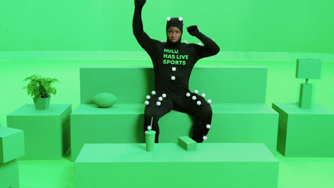

# Week 3 PR

## An All Time Low... We talking Cowboys or Zach's Team?

### Whaddupp

Week 3 is in the books and the league is looking close. Only one undefeated team remains and one winless team remains. I’d say that’s closer than most seasons. We also had a record breaking performance for the lowest scoring team this week. In previous writeups, this team would have just gotten roasted, fried. But it's 2024, year 7 of LGED and we are a happier bunch. A more enlightened group. But still degenerates

In the NFL, we saw two Monday Night Football games, Sam Darnold and the Vikings go 3 - 0 and an amazing comeback by the Rams to beat the 49ers. I can’t forget to mention what hopefully is a failed Cowboys season. We also saw an octopus this week. 

The NFL has its budding story lines, what does the LGED have for us this week?

Let’s get dive in.

 
 

|**Power Rank 1**|
| :------------------------: |
| **Baskin Dobbins - Danny**|
|**Last Week: 1**           |
|**3 - 0**                |
|**PF: 368.34**           |
|**PA: 350.66**            |

The only undefeated team remaining, this week’s Highest Scoring Champ and still top of the power rankings, Baskin Dobbins. Danny is firing on a cylinders early. A 3 - 0 start has to feel good. It almost feels as though Danny’s current roster would have been good the last 3 seasons. Guys like Jonathan Taylor, and Derrick Henry are still putting up fantastic numbers. Dak Prescott has his best game of the early season. Dallas Goedert more than doubles up in fantasy points for the season in one week. With some more than serviceable players on the bench and Deebo Samuel stashed away on IR. Basking Dobbins is not running out of flavors to try anytime soon. Especially with matchup against Yoon Pooned in week 4. 

 
 

|**Power Rank 2**|
| :------------------------: |
| **Kingdom DooDoo - Miles**|
|**Last Week: 2**           |
|**2 - 1**                |
|**PF: 322.3**           |
|**PA: 264.28**            |

The king of DooDoo might have shot an arrow in his own foot this week. Still managed a decent point total which keeps him in the second spot. Miles gets his first loss this season behind some questionable performances… or roster management. Juwan Johnson once again was targeted 0 times. And after kicking the shit out of the ball in the first two weeks, Ka’imi Fairbairn goes for 0 points behind a missed FG and one made XP. Still, besides all that, it was the Jaguars D/ST that sunk him. -4 on Monday Night football. Miles just needed the jaguars to stop maybe a drive or two but they could’t do that. The Kingdom has let a pair of Vikings in and the Kingdom as flourished. Aaron Jones and Justin Jefferson have been the backbone of Miles’ squad. Overall, a wonky week for Miles. I expect him to make some adjustments and be back in the W column. 

 
 

|**Power Rank 3**|
| :------------------------: |
| **Chubby Chasers - Connor**|
|**Last Week: 4**           |
|**2 - 1**                |
|**PF: 276.7**           |
|**PA: 227.16**            |

Connor is just flying under the radar the last two weeks. It’s amazing to see. The last two weeks he’s played the lowest scoring team that week. This week?? He plays the lowest scoring team of ALL TIME in the league. Connor could have played just two guys and would have won. Hell most teams this week could have played just one guy and beat DK’s Left Calf. But do we sit here and punish Connor for these wins?? Hell no. A win is a win in LGED. “Don’t be mad cause Connor doing Connor better than you doing you. Fuck it, What you gon’ do (Whaaat?!)” - Childish Gambino… sort of. This two week stretch has given Connor’s team to truly breakout in the coming weeks. I expect more of the same in week 4 as he plays OJ Forever.

 
 

|**Power Rank 4**|
| :------------------------: |
| **Bantha Poodoo - Eugene**|
|**Last Week: 6**           |
|**2 - 1**                |
|**PF: 335.86**           |
|**PA: 319.4**            |

Anotha one. Eugene has a new name, still feces related, and new two game winning streak. Eugene only has two players go under 10 points this week. DK Metcalf and Rasher Rice are doing it all with over 100 yard games and TDs. The Jake Ferguson pickup and play was a great move this week. And playing a Seahawks D/ST against a backup and eventually the third string QB was big brain as well. If Patrick Mahomes can clean up the turnovers, Eugene’s squad is sitting pretty. The bench looks light though and the roster may look spotty when it comes down to byes or if an injury comes in. But you got to be happy with two wins in a row and with how some of your later round picks in the draft are performing.

 
 

|**Power Rank 5**|
| :------------------------: |
| **AllenAfterDark - Kyle**|
|**Last Week: 3**           |
|**1 - 2**                |
|**PF: 323.46**           |
|**PA: 348.2**            |

Slight tumble for Kyle in this week’s power rankings. Despite some big performances behind Josh Allen and Saquon Barkley, Kyle’s team gets their second loss this season. Allen and Barkley combine for 61.52 points. Barkley even completed the Octopus (when a player scores a touchdown and then the subsequent two-point conversion. The player must be the one carrying the ball into the end zone on both plays).  Kyle will look back at this week and be surprised to lose when two of his players scored over 30 points. Outside of those two, only Khalil Shakir put up good numbers. This is one of those weeks when the stars just don’t align. Guys on Kyle’s team like Zay Flowers and Michael Pittman Jr. took a back seat to their team’s run games. Hopefully that doesn’t continue or else Kyle will be looking for more Octopi in the future. 

 
 

|**Power Rank 6**|
| :------------------------: |
| **I am Kenough Walker - Andrew**|
|**Last Week: 7**           |
|**2 - 1**                |
|**PF: 317.06**           |
|**PA: 235.12**            |

A solid win for Andrew this week. His team didn’t have to do much going up against the second lowest scoring team this week, but there’s a lot to like. Jayden Daniels seems to be that guy of the rookie QBs this season. On Monday Night Football, Daniels threw for 21/23 (an NFL rookie record) for 254 yards and 2 TDs. He also rushed for 39 yards and another TD. Not only is this guy getting you points in fantasy, but he’s making the Commanders look fun. Jahmyr Gibbs and Travis Etienne Jr. are getting good usage and are finding the end zone. DJ Moore is yet to find the end zone this season after receiving the highest WR contract in Bears history. Moore has been getting better every week and might finally be getting that chemistry with rookie Caleb Williams. Andrew’s team is truly doing Kenough at the moment. Which is just what he’s hoping for with Kenneth Walker III out. 

 
 

|**Power Rank 7**|
| :------------------------: |
| **OJ Forever - Anil**|
|**Last Week: 8**           |
|**2 - 1**                |
|**PF: 283.36**           |
|**PA: 330.62**            |

Anil sneaks into Kingdom DooDoo and steals the win for his second win of the season. Anil’s team is finding ways to win without Christian McCaffrey behind the other RBs on his team. Chub Hubbard goes off in the Panthers’ win with 169 yards from scrimmage and a receiving TD. David Montgomery rushed for 105 yards and a TD. Powered by those to players, who needs CMC. The Steelers D/ST recorded 5 sacks and has not dipped below 10 points this season in fantasy. They have only allowed 26 points through 3 games. Like many of us, the rest of the roster just has some ups and downs but nothing Anil can’t handle with the help from the man above? Below? OJ I’m talking about OJ. Let’s see who sneaks out a win in week 4 when Anil goes up against Connor.

 
 

|**Power Rank 8**|
| :------------------------: |
| **Poop Auto - Kai**|
|**Last Week: 9**           |
|**1 - 2**                |
|**PF: 352.38**           |
|**PA: 342.22**            |

Tough, tough loss for Kai for his second of the season. When you score the second highest points in the week but go up against the highest scoring team, it hurts. It feels like a waste. It just sucks. Super next man up and pickup this week Jauan Jennings went off for 41 points behind 11 catches for 175 yards and 3 TDs. Kyren Williams on the other end of the Rams 49er game also went off with 3 TDs himself! Brian Robinson Jr did his best on Monday Night Football to get the win but fell just a little short. If the Buccaneers D/ST don’t let Bo Nix and the Broncos walk all over them Kai might have won this. He would be celebrating with a nice $10 too. At least Kai didn’t play the Cowboys D/ST. Despite the loss, Kai has to be proud of what his team put up. Even if Jennings puts up 15, it’s still a good week for Kai. Just can’t be facing the highest scoring team.

 
 

|**Power Rank 9**|
| :------------------------: |
| **CeeDee-Z Nutz - Matt**|
|**Last Week: 10**           |
|**1 - 2**                |
|**PF: 266.32**           |
|**PA: 336.96**            |

A lot of guys got bumped up one spot in the power rankings this week even after losses thanks to one team that broke the all time low in scoring. Matt’s team is one of those. After bouncing back from a week 1 dud, Matt is gonna need to find some more juice if he wants to get consistent wins. With 103.4 and 106.66 points in week 2 and 3 respectively, those are numbers that beat teams having off weeks or bad just bad teams (like mine). But when you look at his squad, there’s a lot of under performers. CeeDee Lamb is just inconsistent through three weeks. Brandon Aiyuk just finished up preseason. And even though Joe Burrow puts up a good game this week, it was after two pretty mediocre weeks. Matt’s team may need some help if these guys continue to under produce. Chris Olave and Dalton Kincaid look to be heating up. Let’s get these guys some help CeeDee.

 
 

|**Power Rank 10**|
| :------------------------: |
| **Tuadeez receivers - Junghwan**|
|**Last Week: 11**           |
|**1 - 2**                |
|**PF: 266.94**           |
|**PA: 282.34**            |

The younglings came through for Junghwan as he gets his first win of the season. Both Ja’Marr Chase and Malik Nabers combine for 51 points. Garret Wilson on the other hand is still finding his groove. Wilson managed to score a TD but 5 catches for 33 yards is not what you’re hoping for. Wilson is yet to record 60+ yards in a game this season. With Tua Tagovailoa on the IR, QB is something that Junghwan will need to fill. Junghwan won’t lose much though nabbing Tua in the 8th round. I’m sensing a potential Sam Darnold landing spot… It’s not just the QB spot though. RB position for Junghwan’s team needs some help. A injury or trade could put Junghwan and his young guns on the map. Let’s see what he does in week 4 against a team breaking records, DK’s Left Calf. Speaking of…

 
 

|**Power Rank 11**|
| :------------------------: |
| **DK’s Left Calf - Zach**|
|**Last Week: 5**           |
|**1 - 2**                |
|**PF: 279.72**           |
|**PA: 299.88**            |

Man ohhhh man. The tumble was hard from the top. Zach started with a HUGE week 1 and the top spot in the power rankings. To falling down to the 11th spot in week 3 and the: Record. Breaking. Performance. 18.98 points is amazing. This beats our previous lowest scoring week in LGED by at least 10 points. I think it previously was ~30 points. There’s just not much to say here. Almost all of the teams this week had one guy on their team that would have single handedly beat Zach’s team. This is such a bad week, we may as well try to forget it all together. Zach does now hold both the season record highest scoring and lowest scoring week. I think the phrase is, “only up from here”. Now it’s not all terrible. Zach does have some injuries... What am I saying??? 18.98 points is not because of injuries. The only reason Zach wasn’t last was because there is one winless team in the league. Zach, pick yourself up, brush this off and on to week 4. 

 
 

|**Power Rank 12**|
| :------------------------: |
| **Yoon Pooned - Mike**|
|**Last Week: 11**           |
|**1 - 2**                |
|**PF: 240.28**           |
|**PA: 295.88**            |

0 - 3. The last winless team. I’d like to think it’s the Dolphins’ third string quarterback hurting Tyreek Hill. I’d like to think it’s Jalen Hurts not taking care of the ball. I’d like to think it’s Mark Andrews deciding to be an O-lineman. But then I look at the bench with just 6 less points than my entire team. It’s time to get active. Or else we see my team at the bottom of these rankings for the rest of the season. And if that’s the case, I better start looking through the Karaoke catalog. I’ve run out of optimism as I used it on everyone else’s power ranking snippet. Time to get back in the lab.

 
 

#### Good luck you fucking degenerates

[HOME](../index.md)
