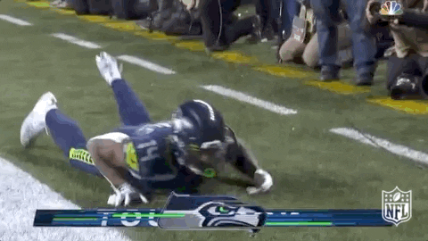

# LGED 24-25 Power Rankings Week 4

## Defense?? No We Want Offesne?... Right?

### Whaddupp

Week four concludes with a fireworks display of offense on Monday Night Football  with the Lions hosting the Seahawks. I always wondered what it must be like to watch your offense be the star of the show as your defense gets dunked on. And I have to say, it’s not as fun as when you lean on the defense. Call me old school.

No changes for the top two spots in this week’s power rankings. We are starting to see streaks form. At the top, we have an undefeated team. At the bottom, a winless team. And everyone else, it’s all too close to call anything. 

Let’s get to it

 
 

|**Power Rank 1**|
| :------------------------: |
| **Baskin Dobbins - Danny**|
|**Last Week: 1**           |
|**4 - 0**                |
|**PF: 497.18**           |
|**PA: 464.48**            |

My oh my. This week Baskin Dobbins served up another win against the only winless team in the league, Yoon Pooned. It would be safe to say it ended up being a closer match than anticipated. Until Derrick Henry broke off an 87 yard TD run for the Raven’s first offensive play of the game. The rest of the game was over thanks to King Henry. Danny’s team just continues to score big even with some injuries on his roster. Through four weeks in fantasy, Danny has two top five RBs, the number one TE and a top ten receiver. I thought my team caught him on an off week, but that just wasn’t the case. Danny might not have an off week with how his roster is put together. His team has three of the top 10 rushers in the NFL this year (Henry, Taylor, Dobbins). A lot of season left, Baskin Dobbins might be on cruise control early.

 
 

|**Power Rank 2**|
| :------------------------: |
| **Kingdom DooDoo - Miles**|
|**Last Week: 2**           |
|**3 - 1**                |
|**PF: 415.08**           |
|**PA: 341.58**            |

Despite an unimpressive win, Miles holds on to the number two spot in this week’s power rankings. Kingdom DooDoo may have to start doing Skol chants regularly as the kingdom is reaping the rewards from the Vikings. Back to back weeks Aaron Jones and Justin Jefferson combine for over 30+ points. Not mind blowing numbers but will keep you winning in a season with a lot of scoring ups and downs. Jones and Jefferson were the backbone to Miles’ win this week. Alvin Kamara continues to be the star as the number one player on Miles’ team and in fantasy for RBs. Kamara is tied with Derrick Henry and Karen Williams for most TDs this year with a total of 6. Reoccurring theme for Miles seems to be some left over points on the bench. If Miles can get a feel for the hot hands on his team, wins will start looking a bit more impressive.

 
 

|**Power Rank 3**|
| :------------------------: |
| **I am Kenough Walker - Andrew**|
|**Last Week: 6**           |
|**3 - 1**                |
|**PF: 417.88**           |
|**PA: 305.02**            |

Andrew’s team breaks the top three in power rankings for the first time this season. His team defeated the lowest scoring team this week, Bantha PooDoo. Like almost everyone in the NFL, I’m sure Andrew (I know I am) are all on the Jayden Daniels hype train. Daniels would be the most intriguing QB in the league if it wasn’t for Sam Darnold. Currently Daniels is the number one QB in fantasy this year. He only has 1 game where he has scored lower than 24 points. Jahmyr Gibbs continues his great season. Gibbs ended his streak of 100+ yards from scrimmage this week but did find the end zone twice against the Seahawks. Andrew’s team has been consistent week to week. Only once has his team scored under 100 points (96.76 in week three). Which is big considering on average in the league teams are barely scoring over 100 points (league average is 100.85 points per week). The benching of his namesake I’m sure was just an oversight. Who needs Kenneth Walker III (31.6 points) anyways???

 
 

|**Power Rank 4**|
| :------------------------: |
| **OJ Forever - Anil**|
|**Last Week: 7**           |
|**3 - 1**                |
|**PF: 375.56**           |
|**PA: 421.62**            |

In this week’s closest matchup, Anil nabs his third win of the season. It was a feisty battle that came down to Monday Night Football. Things were looking smooth with David Montgomery finding the end zone and just chunking off huge plays for the Lions. You know what they say… fantasy games aren’t won on Monday night… No one says that. Work was done for Anil prior to Monday. Chuba Hubbard Goes for 20+ points in back to back weeks. Travis Kelce and C.J. Stroud both have their best games of the season so far with 12.4 and 23.5 points respectively. With the power of Chri- I mean OJ, Anil’s team is finding away. Obviously with Christian McCaffrey out but now Davante Adams is hurt(?) And “prefers” a trade? We are all rooting for Rome Odunze to pop off, go dawgs. Anil with the power of OJ, hopes to continue his three game winning streak against Junghwan in week five.

 
 

|**Power Rank 5**|
| :------------------------: |
| **Poop AUTO - Kai**|
|**Last Week: 8**           |
|**2 - 2**                |
|**PF: 482.7**           |
|**PA: 439.42**            |

Big win this week for Kai as he is your Highest Scoring Champion in week four. Powered by his RBs, Kai’s team is humming along. Kyren Williams and Brian Robinson Jr. have yet to dip below 10 points this season. Nico Collins looks to be C.J. Stroud’s main guy in Houston. Collins has his biggest game of the season with 12 catches for 151 yards and a TD (season high 15 targets). Collins currently leads the league in receiving yards, 103 yards more than the next guy. Jauan Jennings after scoring 3 TDs last week looks to still be serviceable with 3 catches for 88 yards. Lamar Jackson tipped toed his way into the end zone while also throwing for 2 TDs. This is Lamar’s second game in a row with under 20 pass attempts after throwing 41 and 34 times in weeks one and two. Amon-Ra St.Brown has himself a day as well on Monday night recording a receiving and a passing TD (should we make non QB passing TDs worth more?? Just a thought). Kai maximized his team’s output this week. He’ll need to continue to do so against a steady I am Kenough Walker in week five.

 
 

|**Power Rank 6**|
| :------------------------: |
| **Chubby Chasers - Connor**|
|**Last Week: 3**           |
|**2 - 2**                |
|**PF: 367.7**           |
|**PA: 319.36**            |

A tough loss for Connor in week four. Connor almost pulled of the heist on Monday night behind Geno Smith. He found himself winning with under two minutes to go in the game. Smith, tried some late game heroics and threw an interception. Thus sinking Connor’s comeback hopes and handing his team his second loss of the season. I really thought Connor was going to win it. So much so, I said out loud in my house “HE CAN’T KEEP GETTING AWAY WITH IT”. But then he didn’t, it was a good laugh. Since week one, Connor has not broken over 100 points. In fact, this was his first time scoring over 90 since then. Things are trending upward though. Mike Evans and Stefon Diggs are doing their part. Meanwhile, Breece Hall and Rachaad White aren’t doing shit. That’s a bit harsh. I just wanted to reference another meme. But White really hasn’t been doing much. Like most of us, there seems to be help on the bench. Let’s see what Connor turns to after a brutal loss in week four.

 
 

|**Power Rank 7**|
| :------------------------: |
| **Bantha Poodoo - Eugene**|
|**Last Week: 4**           |
|**2 - 2**                |
|**PF: 405.76**           |
|**PA: 420.22**            |

Bantha PooDoo, Eugene’s team, is your lowest scoring champ this week. Some noticeable duds. Bijan Robinson has not lived up to his first round pick hype. Robinson put up his worst game this season with 9.4 points. Despite the Chiefs being 4 - 0, Patrick Mahomes has not been that guy in fantasy and has yet to score over 18 points. Mahomes threw another interception making his total five for the season. That puts him third for QBs behind Anthony Richardson and Will Levis. Put down one injured teammate as well for Mahomes as he collides with Eugene’s own Rashee Rice. It’s feared Rice could have a season ending ACL injury. Bantha PooDoo shouldn’t feel too down. Again, there seems to be help on the bench. Brian Thomas Jr. and Jordan Addison both had great weeks. You may not be able to count on them like you might have Rice, but they get targets. Well at least Thomas Jr., Addison played just his second game of the season in week four. Things are starting to get tough out there, let’s see how Eugene responds after this dud of a week against a battered Yoon Pooned. 

 
 

|**Power Rank 8**|
| :------------------------: |
| **Tuadeez receivers - Junghwan**|
|**Last Week: 10**           |
|**2 - 2**                |
|**PF: 390.82**           |
|**PA: 378.62**            |

Tuadeez receivers??? Let em know young bloods! Except you Garret Wilson. Junghwan gets his second win in a row. This week though it wasn’t all the young blood receivers. Baker Mayfield did it all for the Buccaneers with 3 total TDs and 347 passing yards. D’Andre Swift has a monster game for the Bears with 165 yards from scrimmage and a rushing TD. Of course Junghwan’s receivers did their thing (except Wilson). Ja’Marr Chase and Malik Nabers combine for 33.1 points. Nabers is second in receiving yards this season (is that Daniel Jones throwing to him??) It’s starting to feel like Junghwan’s team has warmed up a bit. 123.88 being his team’s highest point total this season. If the Jets can figure out their offense, no one will be asking Tuadeez receivers. With bye weeks coming into play, how Junghwan can fill some of those holes with guys on his bench will be a big question mark. Depth is key in fantasy. Next week, Junghwan faces off against another streaking team, OJ Forever.

 
 

|**Power Rank 9**|
| :------------------------: |
| **AllenAfterDark - Kyle**|
|**Last Week: 5**           |
|**1 - 3**                |
|**PF: 400.76**           |
|**PA: 440.98**            |

Kye’s team records his third loss in a row this season thanks to Kingdom DooDoo. Josh Allen has his worst game of this early season. Zay Flowers but up another bad performance. Allen and Flowers combine for 8.8 points. Saquon Barkley surprisingly did not find the end zone. What’s been remarkable for Kyle is Jordan Mason’s continued great production. Mason is second in rushing so far this season just behind Derrick Henry and is currently the fifth ranked RB in fantasy. Kyle needs his WRs to pick it up. If Flowers is gonna be inconsistent, it’s gonna be guys like Tee Higgins and Michael Pittman Jr. to find their groove. This was a winnable matchup when the other team scored under 100 points. Kyle is on a slight downward trend. But I don’t expect that to continue with guys like Josh Allen playing the way he did this week. Not to mention Joe Mixon hopefully returning from injury as well. Perhaps Kyle can stop the skid in week five against another team on a three game losing streak, DK’s Left Calf.

 
 

|**Power Rank 10**|
| :------------------------: |
| **CeeDee-Z Nutz - Matt**|
|**Last Week: 9**           |
|**1 - 3**                |
|**PF: 363.5**           |
|**PA: 467.28**            |

Back to back tough losses for Matt. Even though he didn’t quite have the fire power, going up against two teams in back to back weeks that score 120 points or more sucks. Slow and inconsistent starts are hurting Matt’s team. James Cook and the Bills seem to just have an off night. Chris Olave is producing despite a Saints team that seems to be struggling offensively. Joe Burrow and the Bengals usually pick it up after their usual opening losses. At least CeeDee Lamb put his money where his mouth is and went off after calling himself out. There is only really one question mark, Brandon Aiyuk. Hopefully he turns it around soon or he may just be this the rest of the season. A shakeup may be needed for Matt’s team. I still think a trade my do him some good, but those are always tough to come out on top. Next week comes a tough matchup against the undefeated Baskin Dobbins.

 
 

|**Power Rank 11**|
| :------------------------: |
| **DK's Left Calf - Zach**|
|**Last Week: 11**           |
|**1 - 3**                |
|**PF: 376.0**           |
|**PA: 423.76**            |

Things have not gotten easier for Zach in week four as he gets his third loss in a row. Bounced back quick though after his amazing performance last week. Justin Fields had his best game of the season with 312 passing yards, 55 rushing yards and 3 total TDs (2 rushing). Fields alone would have beat Zach last week. James Connor finds the end zone again and rushes for 104 yards. And Wan’Dale Robinson racked up 11 catches for 71 yards. There are some players to worry about though. The Patriots are considering starting Antonio Gibson over Rhamondre Stevenson due to ball security issues. Jaylen Waddle has had a different QB almost every week this season. Without these two guys producing or some strong waiver wire pickups, there isn’t much on the bench to help fill these spots. A.J. Brown hopefully comes back soon. Isiah Pacheco could give you some meaningful points in later weeks. Whatever the move Zach decides, three QBs on your roster isn’t the answer right now.

 
 

|**Power Rank 12**|
| :------------------------: |
| **Yoon Pooned - Mike**|
|**Last Week: 12**           |
|**0 - 4**                |
|**PF: 354.1**           |
|**PA: 424.72**            |

My best game of the season gets trucked by Derrick Henry. The winless tour continues. Although weeks like this keep me positive. Guys were making plays for the team. Marvin Harrison Jr. has shown so far why I drafted him in the third round. Harrison Jr. currently is the ninth ranked WR in fantasy. Diontae Johnson is loving Andy Dalton in Carolina. In week three, Johnson had 14 targets which was more than he received from Bryce Young in weeks one and two combine. Week four for Johnson? 13 targets. Zach Moss and Josh Jacobs have been serviceable. But the issues remain and they hurt. Jalen Hurts does well but is still turnover prone. Tyreek Hill is finally showing some outward frustration (as am I). I benched Mark Andrews until he shows signs of life. It might be time to bench Hill as well. Drastic times calls for drastic measures. Let’s see what the squad can do against Bantha Poodoo.

 
 

#### Good luck you fucking degenerates

[HOME](../index.md)
