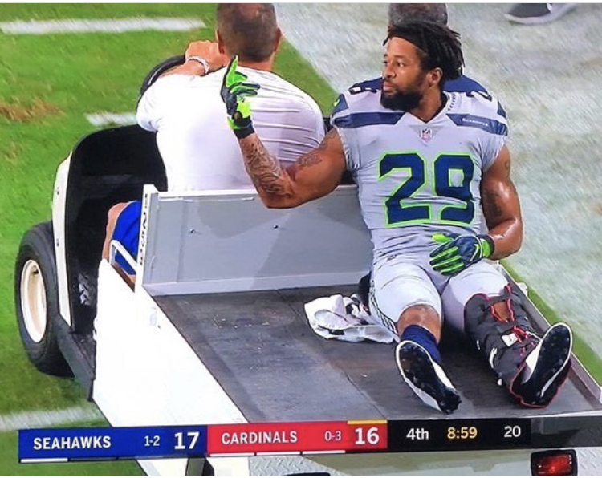

# LGED 24-25 Power Rankings Week 6

## Two weeks changes everything...

### Whaddupp

After a quick bye week for the write-ups, we are back. Two weeks really can change the fate of your fantasy team and even your favorite NFL team.

Seahawks lost three games in 11 days. The Cowboys have sunk even lower. The NFC North is just tearing it up, yes even the Bears. And there are two undefeated teams left in the NFL. That’s two more than the LGED.

In LGED, we see the remaining undefeated team go down. Two teams on four game losing streaks. A winless team finally gets not just one but TWO wins. The LGED is still up for grabs! Except maybe the top spot, but the playoffs are wide open. What am I saying, it’s only week six. No one is out of it just yet…. Right?

Let’s get into it

 
 

|**Power Rank 1**|
| :------------------------: |
| **Baskin Dobbins - Danny**|
|**Last Week: 1**           |
|**5 - 1**                |
|**PF: 735.38**           |
|**PA: 685.54**            |

The undefeated streak ends in week six as Danny gets his first loss of the season against Kyle. Kyle was this week’s highest scoring champ. Who was second this week? Danny. He shouldn’t even be disappointed in this loss. Dak Prescott put up a complete dud with 3.22 points. Dallas Goedert left the game with hamstring injury and recorded nothing. Yet Danny loses only by 4.18 points. This was a very winnable matchup. Nothing more to say here, just a small hiccup in the road for Baskin Dobbins. 

 
 

|**Power Rank 2**|
| :------------------------: |
| **Tuadeez receivers - Junghwan**|
|**Last Week: 10**           |
|**4 - 2**                |
|**PF: 668.32**           |
|**PA: 544.98**            |

AND HERE COMES JUNGWHAN!!! Four wins a row has shot Junghwan up the power rankings to second place. The past two weeks Junghwan has been without Malik Nabers. Coming off his highest scoring champion win in week 5, Junghwan’s team just stays hot. Baker Mayfield has vaulted himself to the number two QB in fantasy. D’Andre Swift has been putting up 26.0, 19.0 and 19.9 points in the last three weeks respectively. Garrett Wilson must have been reading the write-ups as he has had back to back 20+ point performances. Like everyone, what will Davante Adams bring to the Jets’ WR room and mainly Wilson’s targets. Who cares! Junghwan has won four straight and has Yoon Pooned next.

 
 

|**Power Rank 3**|
| :------------------------: |
| **Kingdom DooDoo - Miles**|
|**Last Week: 2**           |
|**4 - 2**                |
|**PF: 614.94**           |
|**PA: 553.04**            |

Miles falls to 4 - 2 after being this week’s Lowest Scoring Champ. Kingdom DooDoo’s Vikings were given break thanks to a bye week. Without the Kingdom’s main source of fire power, Miles found his team losing this week’s fight. Miles like most of us is also looking for answers at the TE position. He has both Jaguars’ TE but just played the wrong one this week. Evan Engram in his first game back from injury has 13.2 points on Miles’ bench. Alvin Kamara and Drake London are showing out for the NFC South. Kamara is RB2 and London is WR5 through 6 weeks. Some worry with Aaron Jones coming off a hip injury, Miles prepared with his handcuff Ty Chandler. Don’t forget about Puca Nacua that Miles has stashed away on IR. A great start without him has Miles still sitting pretty so far this season.

 
 

|**Power Rank 4**|
| :------------------------: |
| **OJ Forever - Anil**|
|**Last Week: 4**           |
|**4 - 2**                |
|**PF: 553.88**           |
|**PA: 665.98**            |

OJ is truly blessing Anil as he grabs his fourth win of the season. The blessing has come in points allowed for Anil as all his wins have come against teams scoring under 95 points. It’s not that weird though as last week I mentioned the average points per week is barely 100. Opportunity strikes, so does OJ… I mean Anil. If we flip the script a bit, Anil’s losses so far have only been against the highest scoring champion that week. The points for and points allowed for Anil is a bit confusing. But we’ve seen a .500 team win the league before. Don’t forget about CMC either.

 
 

|**Power Rank 5**|
| :------------------------: |
| **Poop AUTO - Kai**|
|**Last Week: 5**           |
|**3 - 3**                |
|**PF: 687.14**           |
|**PA: 655.82**            |

A couple byes and injuries this week has Kai under performing in week six for his third loss of the season. Kai has scored 147.38, 130.32 and 121.82 in the three weeks prior. 82.62 points for him this week for his lowest point total of the season so far. It hasn’t all been who you’d expect on Kai’s team. Big performances from the likes of Kyren Williams and Juan Jennings have kept Kai running the score up. Amon-Ra St. Brown has yet to blow up but has been steady. Brian Robinson Jr. is loving the new Commanders offense as he’s been just as steady as St. Brown. Kai  won’t need 120+ points every week to win moving forward, but will be needing consistency as the season continues. Still, a point blow up every week will get you pretty far.

 
 

|**Power Rank 6**|
| :------------------------: |
| **Chubby Chasers - Connor**|
|**Last Week: 6**           |
|**3 - 3**                |
|**PF: 600.44**           |
|**PA: 520.76**            |

Good win for Connor and the Chubb Chasers to reach .500 on the season. Connor pretty much maximized his team’s output this week. He seems to have a decent feel for his team so far this season. Unfortunately, it hasn’t been that fruitful. His previous two wins was were his team’s lowest performances. This week it seemed to come together. George Kittle has been crushing it this season and is TE1. RB is the real issue for Connor. This week, Connor put both Jets RB in. Worked out this week but Breece Hall had 19.4 points while Braelon Allen had 0.8. Not sure where he’ll get more production on his current roster. I expect Connor to be looking on the waivers or perhaps a trade. Either way, he’s in a comfortable spot. 

  
 

|**Power Rank 7**|
| :------------------------: |
| **I am Kenough Walker - Andrew**|
|**Last Week: 3**           |
|**3 - 3**                |
|**PF: 601.16**           |
|**PA: 521.42**            |

Second loss in a row for Andrew. His team has been good so far. Middle of the pack so far in points for. And the second least points allowed. You could think of this as luck but it seems to be more on the ups and downs his team has. QB aside, the last two losses Andrew’s team has had three players with 10+ points and it’s three different guys every time. Kenneth Walker II is the only consistent guy in the last two weeks to go 10+ points. I guess he really is Kenough. But hey forget all that, the Jayden Daniels train is still going and it’s a hell of a ride.

 
 

|**Power Rank 8**|
| :------------------------: |
| **DK’s Left Calf - Zach**|
|**Last Week: 11**           |
|**3 - 3**                |
|**PF: 599.88**           |
|**PA: 606.22**            |

Crazy what two weeks can change in the early fantasy season. After three losses in a row, Zach has captured two wins in a row. Over 100+ point performances the last two weeks really means a lot this season. Brock Bowers in his rookie season has been great. Rhamondre Stevenson didn’t lose his job. James Connor is just producing despite his week six hiccup. Jordan Love since coming back from injury has just been crushing it. Sure he has five interceptions, but he also has 10 TDs since his return. Zach’s team is climbing back after a bump in the road. AJ Brown’s return also solidifies Zach’s WRs. Touch matchup ahead against Baskin Dobbins.

 
 

|**Power Rank 9**|
| :------------------------: |
| **Allen After Dark - Kyle**|
|**Last Week: 5**           |
|**2 - 4**                |
|**PF: 642.00**           |
|**PA: 683.16**            |

After four straight losses, nothing feels as good as breaking that streak against the only remaining undefeated team in the league. Kyle takes down Danny. Joe Mixon returned in a big way with 132 yards from scrimmage plus 2 total TDs. Good skill position performances powered by a strong D/ST and K performance, that’s a dub. The four losses came against some the league’s hotter teams. Those team’s record combine were 15 - 9. The next few matchups should be a bit softer as the next five weeks are against teams with records .500 or worse. I’m expecting bit of surge for Allen After Dark.

 
 

|**Power Rank 10**|
| :------------------------: |
| **Yoon Pooned - Mike**|
|**Last Week: 12**           |
|**2 - 4**                |
|**PF: 551.76**           |
|**PA: 574.02**            |

Like I said earlier, two weeks makes a word of difference. A two game winning streak for my team??? It can’t be. All it took was playing back to back lowest scoring teams in a row. Gonna have to give some credit to my own team. Week five my team scored over 105+ points. Week six, I had two players come up with zeros. Everybody needs a little luck in fantasy. Even the team that was winless through the first four weeks. The tough part is deciding whether or not to bench Tyreek Hill week to week. At least in week six he was on bye. Next up is a streaking Tuadeez receivers.

 
 

|**Power Rank 11**|
| :------------------------: |
| **Bantha Poodoo - Eugene**|
|**Last Week: 7**           |
|**2 - 4**                |
|**PF: 556.60**           |
|**PA: 638.16**            |

Oh my daaayyys. Three losses in a row for Eugene. The last three weeks, Eugene’s team has failed to score over 80 points. Consistency is key this season. So far, Eugene’s team hasn’t shown much of it. Rashee Rice is out for the season. DK Metcalf has gone a little stale in the Seahawks’ losing streak. It seems like Eugene’s team has bought all in on RBs this season. After Metcalf, the other receivers on his team include Brian Thomas Jr., Jakobi Meyers and Jordan Addison. Yikes. Not exactly the most reliable bunch. If anything, WRs are plentiful in the league. Might have to shop around a bit or even scrounge the waiver wire. Eugene has done that well so far with pickups like Kareem Hunt. Just have to keep pushing.

 
 

|**Power Rank 12**|
| :------------------------: |
| **CeeDee-Z Nutz - Matt**|
|**Last Week: 12**           |
|**1 - 5**                |
|**PF: 524.78**           |
|**PA: 687.28**            |
After beating Yoon Pooned in week two, Matt has lost four in a row. He’s been beat up on a bit. His last four opponents have averaged 117.83 points. That’s a tough rate to keep up at this season. Mix in the woes of CeeDee Lamb and Brandon Aiyuk and it’s a recipe for disaster. Things get worse as Chris Olave is out this coming week due to a concussion. James Cook had an injury in week six keeping him out. A lot of question marks are popping up for Matt’s roster. He’ll have to stay hungry on the waiver wire to answer some of those questions. Hopefully after the week seven bye for the cowboys, Lamb bounces back. Not out yet, plenty of time to add some W’s.

 
 

#### Good luck you fucking degenerates

[HOME](../index.md)
